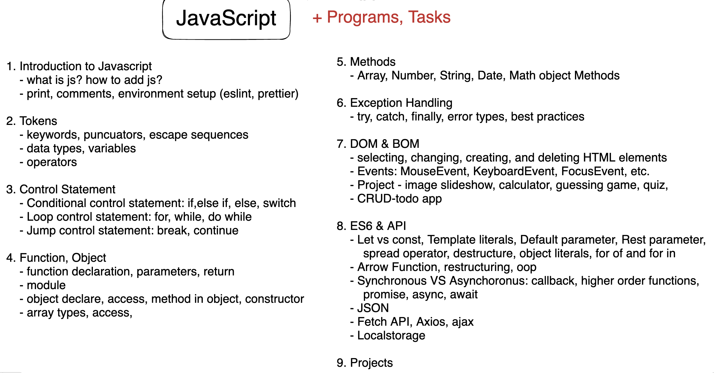

# javascript-documentation



## Table of Contents

1. [Basic Javascript Topics](#1-basic-javascript-topics)

   [1.1 Introduction to Javascript](#11-introduction-to-javascript)
   [1.2 Output Console Object & comment](#12-output--comment)
   [1.3 Tokens - variables, data types, operators](#13-tokens)

   [1.4 Control Flow](#14-control-statement)

   [1.5 Function](#15-function---traditional)

   [1.6 Hositing, scope of variables and closures](#16-hoisting-scope-of-variables--closures)

   - [1.6.1 Hositings](#161-hoisting)
   - [1.6.2 Scope of variables and closures](#162-scope-and-closures)
   - [1.6.3 var, let, const](#163-var-let-const)

   [1.7 Objects](#17-objects)

   [1.8 Arrays](#18-arrays)

   [1.9 Built-in methods](#19-built-in-methods)

   [1.10 Error Handling](#110-errors-and-errors-handling)

   [1.11 JSON and JSDoc](#111-json-and-jsdoc)

2. [Intermediate JavaScript Topics](#2-intermediate-javascript-topics)

   [2.1 Document Object Model (DOM) and Events](#21-document-object-model-dom-and-events)

   [2.2 Browser Object Model (BOM)](#22-browser-object-model-bom)

   [2.3 Local storage](#23-local-storage)

   [2.4 ES6 Features](#24-es6-features)

   [2.5 Higher order and callback functions](#25-higher-order-and-callback-functions)

   [2.6 Best Practices](#26-best-practices)

   [2.7 npm & ESLint setup](#27-npm--eslint-setup)

   [2.8 You must know](#28-you-must-know)
   [2.9 API Calling](#29-api-calling)

3. [Advanced JavaScript Topics](#3-advanced-javascript-topics)
   [3.1 OOP](#31-object-oriented-programming-oop)
   [3.2 Testing and Debugging]()

   - [Unit testing with frameworks like Jest]()
   - [Debugging tools and techniques]()

   [3.3 Security]()

   - [Cross-Site Scripting (XSS) prevention]()
   - [Cross-Site Request Forgery (CSRF) prevention]()
   - [Content Security Policy (CSP)]()

   [3.4 Performance Optimization]()

   - [Code optimization]()
   - [Network optimization (lazy loading, asset compression)]()
   - [Rendering optimization (requestAnimationFrame)]()

   [3.5 Design Patterns]()

   - [Singleton pattern]()
   - [Module pattern]()
   - [Observer pattern]()
   - [Factory pattern]()

   [3.6 Project ideas]()

   - Caclulator - basics, BMI
   - Converter - Temperature
   - guessing game, dynamic cards, user preference (youtube)
   - API - Weather, Joke, Dog, Products
   - [Todo CRUD APP](https://todo-crud-app-2023.netlify.app/)

## 1. Basic Javascript Topics

### 1.1 Introduction to Javascript

- What is Javascript?

  - A programming language for web.
  - it can be used in front-end and back-end
  - It adds interactivity to the web page such as adding items to the carts, form validation etc.
  - Example: Create a button with HTML, Style with CSS and add clicking functionality by using javascript
  - A demo

    ```js

        // index.html
        <!DOCTYPE html>
        <html lang="en">
          <head>
            <meta charset="UTF-8" />
            <meta name="viewport" content="width=device-width, initial-scale=1.0" />
            <title>Document</title>
            <link rel="stylesheet" href="test.css" />
          </head>
          <body>
            <h1>Welcome to JS</h1>
            <button onclick="deleteItem()">Delete</button>
          </body>
        </html>

        // style.css
        button {
          background-color: green;
          color: white;
          padding: 0.5rem;
          border: none;
          border-radius: 5px 5px;
        }

        // index.js
        function deleteItem() {
          alert("The item is deleted!");
        }

    ```

- What are the ways to add javascript?

  - **Inline JavaScript:**

    Inline JavaScript is directly embedded within an HTML document using the `<script>` tag. It's placed directly within the HTML code and typically used for small scripts or quick actions.

    ```html
    <!DOCTYPE html>
    <html>
      <head>
        <title>Inline JavaScript Example</title>
      </head>
      <body>
        <h1>Welcome to JS</h1>
        <button onclick="alert('The item is deleted!')">Delete</button>
      </body>
    </html>
    ```

    In this example, the JavaScript code `alert('The item is deleted!')` is executed when the button is clicked.

  - **Internal JavaScript:**

    Internal JavaScript is placed within the HTML document, but it's placed in the `<script>` tag within the `<head>` or `<body>` section of the HTML. This allows you to keep your JavaScript separate from your HTML content.

    ```html
    <!DOCTYPE html>
    <html>
      <head>
        <title>Internal JavaScript Example</title>
        <script>
          function deleteItem() {
            alert("The item is deleted!");
          }
        </script>
      </head>
      <body>
        <h1>Internal JavaScript Example</h1>

        <button onclick="deleteItem()">Delete</button>
      </body>
    </html>
    ```

    In this example, the JavaScript function `deleteItem()` is defined within the `<script>` tag in the HTML document and called when the button is clicked.

  - **External JavaScript:**

    External JavaScript is stored in a separate .js file and linked to the HTML document using the `<script>` tag's `src` attribute. **This approach is ideal for larger scripts and helps keep your HTML clean and organized.**

    **index.html:**

    ```html
    <!DOCTYPE html>
    <html>
      <head>
        <title>External JavaScript Example</title>
      </head>
      <body>
        <h1>External JavaScript Example</h1>

        <button onclick="deleteItem()">Click Me</button>
        <script src="script.js"></script>
        <script src="script2.js"></script>
      </body>
    </html>
    ```

    **script.js:**

    ```javascript
    function deleteItem() {
      alert("The item is deleted!");
    }
    ```

    In this example, the JavaScript code is stored in an external file named `script.js` and linked to the HTML file using the `<script>` tag's `src` attribute.

    External JavaScript is often preferred for better code organization and maintainability, especially in larger web applications where you may have multiple scripts.

### 1.2 Output & comment

- output functions: functions that will help you to show output such as document.write(), window global object -> console.log(), lert(), confirm()
- console

  - In JavaScript, the `console` object is a built-in object that provides a way to interact with the browser's debugging console or the console of other JavaScript environments (like Node.js). It's commonly used for debugging, logging information, and monitoring the behavior of your code. Here are some important functions and methods provided by the `console` object:

    1. **`console.log(...args)`**: This is one of the most commonly used functions. It logs the provided arguments to the console. For example:

       ```javascript
       console.log("Hello, world!");
       ```

    2. **`console.error(...args)`**: Logs error messages to the console with a red icon. Useful for reporting errors and issues in your code.

       ```javascript
       console.error("An error occurred.");
       ```

    3. **`console.warn(...args)`**: Logs warning messages to the console with a yellow icon. It's often used for non-fatal issues or potential problems.

       ```javascript
       console.warn("This is a warning message.");
       ```

    4. **`console.info(...args)`**: Logs informational messages to the console with a blue icon. Useful for general information about your code's behavior.

       ```javascript
       console.info("This is an informational message.");
       ```

    5. **`console.debug(...args)`**: Logs debugging messages to the console. These messages are typically used for detailed debugging information and may not be shown in all console environments.

       ```javascript
       console.debug("Debugging information.");
       ```

    6. **`console.clear()`**: Clears the console, removing all previous log messages. Useful for keeping the console tidy during debugging sessions.

       ```javascript
       console.clear();
       ```

    7. **`console.group(label)`** and **`console.groupEnd()`**: These methods allow you to group related log messages together. You can create a group using `console.group(label)` and close it with `console.groupEnd()`. This is particularly useful for organizing logs in complex applications.

       ```javascript
       console.group("Group Label");
       console.log("Log message 1");
       console.log("Log message 2");
       console.groupEnd();
       ```

    8. **`console.table(data)`**: Displays tabular data in a table format. This is especially helpful for visualizing arrays or objects.

       ```javascript
       const data = [
         { name: "Alice", age: 30 },
         { name: "Bob", age: 25 },
       ];
       console.table(data);
       ```

    9. **`console.time(label)`** and **`console.timeEnd(label)`**: These methods are used to measure the time it takes to execute a piece of code. You start a timer with `console.time(label)` and stop it with `console.timeEnd(label)`.

       ```javascript
       console.time("Timer");
       // Code to measure execution time
       console.timeEnd("Timer");
       ```

- Comments in JavaScript are used to provide explanations or additional information within your code. They are not executed by the JavaScript interpreter and are meant for human readability. JavaScript supports two primary types of comments:

  1. **Single-line Comments**:

     - Denoted by `//`.
     - Anything following `//` on the same line is treated as a comment and is ignored by the JavaScript engine.
     - Single-line comments are used for brief explanations or notes.

     ```javascript
     // This is a single-line comment
     var x = 5; // Assigning a value to a variable

     const area = 0.5 * base * height; // area of triangle = 1/2 * base * height

     // TODO: Create a new Todo
     console.log("Create a new Todo");

     // TODO: Read all the todos
     // FIXME: Unable to read all the todos
     console.log("Listed all the todos");

     // TODO: update a Todo
     console.log("Todo is updated");

     // TODO: delete a todo
     console.log("Todo is deleted");
     ```

  2. **Multi-line Comments**:

     - Enclosed between `/*` and `*/`.
     - Multi-line comments can span across multiple lines and are often used for more extensive explanations, documentation, or temporarily "commenting out" blocks of code.

     ```javascript
     /*
         This is a multi-line comment.
         It can span across multiple lines.
     */

     /*
     function oldCode() {
         // This entire function is "commented out" and won't run.
     }
     */
     ```

  - **Needs and Use Cases for Comments in JavaScript**:

  1. **Code Explanation**: Comments are used to explain complex sections of code, making it easier for developers (including yourself) to understand the purpose and functionality of code blocks.

  2. **Documentation**: Comments can serve as a form of documentation, providing information on how to use functions, classes, or libraries, including descriptions of parameters and return values.

  3. **TODO Lists**: Developers often use comments with "TODO" or "FIXME" labels to highlight areas of code that need attention or future enhancements.

  4. **Disable Code**: Comments can be used to temporarily disable lines or blocks of code for debugging or testing purposes without deleting the code.

  5. **Version History**: Comments can include information about the version of the code, date of last modification, and author details for version control and collaboration.

  6. **Algorithmic Explanation**: When implementing complex algorithms, comments can help explain the logic and steps involved.

  7. **Cross-browser Compatibility**: Comments may include notes about specific browser-related workarounds or compatibility issues.

  8. **Debugging**: Comments can aid in debugging by providing context or identifying problematic areas.

  9. **Code Organization**: Comments can be used to divide code into sections, making it easier to navigate and understand.

  While comments are essential for code readability and collaboration, it's also crucial to keep them up to date. Outdated comments can be misleading and may not accurately reflect the current state of the code. Therefore, it's good practice to maintain comments as you make changes to your code.

- **Tasks 1: Can you print your name, age, address?**
- **Program 1: E-Commerce app [printing product details]**

  ```js
  // prodcut details
  /*
  id : 1
  title : iphone 12
  description: brilliant phone with 4k camera
  price : 549
  discountPercentage : 8
  rating : 4.69
  brand : Apple
  */

  // product actual price calculator [printing product details]
  console.log("id : 1");
  console.log("title : iphone 12");
  console.log("description: brilliant phone with 4k camera");
  console.log("price : 510");
  console.log("discountPercentage : 8");
  console.log("rating : 4.69");
  console.log("brand : Apple");
  ```

- setup prettier code formatter

### 1.3 Tokens

- Tokens are backbone of any programming language. Important tokens: keywords, puncuators, escape sequences, data type, variables, operators, etc.

#### 1.3.1 Keywords, puncuators and Escape sequences

- Keywords: javascript reserved words for specific reasons.

  - Example - abstract, break, char, double, export, import, try, catch, finally, throw, throws, if, else, switch, case, break, default, continue,for, while, do, var, let, const, class, extends, implements, public, private, protected, new, static, this, true, false, boolean, string, number, function, instanceof

- puncuators
  - () round brackets / parentheses
  - {} curly brackets / braces
  - [] square brackets / brackets
  - <> angle brackets / chevrons
  - ; semicolon, : colon
- Escape sequnces: \ characters
  Escape sequences in JavaScript are used to represent special characters or control characters within strings. They begin with a backslash (`\`) followed by a specific character, and they are used to produce characters that are otherwise difficult to type or include in a string directly. Here are some common escape sequences in JavaScript:

  1. **Newline (`\n`)**: Represents a line break or a new line character.

     ```javascript
     var text = "This is line 1.\nThis is line 2.";
     console.log(text);
     ```

     Output:

     ```js
     This is line 1.
     This is line 2.
     ```

  2. **Tab (`\t`)**: Represents a tab character.

     ```javascript
     var indentedText = "First\tSecond\tThird";
     console.log(indentedText);
     ```

     Output:

     ```js
     First   Second  Third
     ```

  3. **Backslash (`\\`)**: Represents a literal backslash character.

     ```javascript
     var filePath = "C:\\Program Files\\MyApp\\file.txt";
     console.log(filePath);
     ```

     Output:

     ```js
     C:\Program Files\MyApp\file.txt
     ```

  4. **Single Quote (`\'`)**: Represents a single quotation mark within a single-quoted string.

     ```javascript
     var singleQuoted = "This is an example of a single quote: 'Hello'";
     console.log(singleQuoted);
     ```

     Output:

     ```js
     This is an example of a single quote: 'Hello'
     ```

  5. **Double Quote (`\"`)**: Represents a double quotation mark within a double-quoted string.

     ```javascript
     var doubleQuoted = 'This is an example of a double quote: "Hello"';
     console.log(doubleQuoted);
     ```

     Output:

     ```js
     This is an example of a double quote: "Hello"
     ```

  6. **Unicode Characters (`\uXXXX`)**: Represents a character using its Unicode code point in hexadecimal (XXXX).

     ```javascript
     var smileyFace = "\u263A";
     console.log(smileyFace);
     ```

     Output:

     ```js
     ☺
     ```

  These escape sequences allow you to include special characters or characters that have special meanings within your strings without causing syntax errors or unexpected behavior.

#### 1.3.2 Data types

Data types: [typeof operator] can help us to find out the data type of a value. Data types can be divided into 2: primitive & non-primitive/reference.

- Primitive data types: Primitive data types are also known as in-built data types. String, Number, Bigint, boolean, null, undefined, symbol

  - Example

    ```js
    // primitive data types -> String, Number, Boolean, null, undefined, Symbol

    // String data type ->  Represents sequences of characters, such as text.
    console.log(typeof "John"); // string
    console.log(typeof ""); // empty string

    // Boolean data type -> Represents a true or false value.
    console.log(typeof true); // boolean

    // Number data type -> Represents numeric values, both integers and floating-point numbers.
    console.log(typeof 123); // number
    console.log(typeof 123.5); // number

    // Undefined: variable is declared but no value is assigned
    // Undefined -> data type for variable without value
    console.log(typeof x); // undefined

    // null ->  Represents the intentional absence of any object or value.(fun: typeof null is object)
    console.log(typeof null);

    /*
    Symbol is used as an identifier for object properties
     Symbols are unique identifiers
     introduced in ES6
     it can be used when defining constants such as enum for uniqueness
     */
    const symbol1 = Symbol("foo");
    const symbol2 = Symbol("foo");
    console.log(typeof symbol1); // symbol
    console.log(symbol1 === symbol2); // false

    const symbol = Symbol("Bye");
    console.log(typeof symbol);
    console.log(symbol);

    // BigInt: Represents large integers with arbitrary precision (introduced in ECMAScript 2020). This data type can represent numbers greater than 253-1 which helps to perform operations on large numbers. The number is specified by writing ‘n’ at the end of the value

    var bigNumber = 125522222222222222222222222222222222222n;
    console.log(bigNumber);
    ```

- Non Primitive data types: non-primitive data types are derived from primitive data types. It is also known as derived data types or reference data types. Object (Array is also part of Object type), Function.

  - Example

    ```js
    // Object type -> Represents a collection of key-value pairs (properties) where values can be of any data type, including other objects.
    console.log(tyoeof {name: 'anis'});
    console.log(typeof [1,2,3]) // array is object type

     // function type -> Represents a reusable block of code that can be executed.
     console.log( typeof function display () { }) // function type

    ```

- **what are the differences between primtive & non-primitive data types?**
  

  ```js
  // Copying by value
  let num1 = 5;
  let num2 = num1; // num2 gets the value of num1

  num2 = 10; // Modifying num2 does not affect num1

  console.log(num1); // Output: 5
  console.log(num2); // Output: 10

  // Copying by reference
  let arr1 = [1, 2, 3];
  let arr2 = arr1; // arr2 references the same array as arr1

  arr2.push(4); // Modifying arr2 also affects arr1

  console.log(arr1); // Output: [1, 2, 3, 4]
  console.log(arr2); // Output: [1, 2, 3, 4]
  ```

- **[truthy](https://developer.mozilla.org/en-US/docs/Glossary/Truthy) vs [Falsy value](https://developer.mozilla.org/en-US/docs/Glossary/Falsy)**
  - falsy value: false, 0, 0.0, -0, -0.0, "",'',``,null, undefined, NAN (Not-a-Number)
  - truthy value: all values except falsy value. {}, [], new Date(), Infinity etc.
- **Data type conversion in js**
  JavaScript provides several methods for type conversion, allowing you to convert data from one type to another. Here are some common methods and examples:

  1. **Implicit Type Conversion (Coercion):** JavaScript automatically converts data types in certain situations. For example, when you use the `+` operator with different data types, JavaScript may implicitly convert them to a common type (usually a string or a number).

     ```javascript
     const num = 5;
     const str = "10";

     // JavaScript implicitly converts 'str' to a number before addition
     const result = num + str; // result is 15 (a number)
     ```

  2. **Explicit Type Conversion (Type Casting):** You can explicitly convert data types using various methods. Here are some common ones:

     - **String Conversion:** Use `String()` or `.toString()` to convert a value to a string.

       ```javascript
       const num = 42;
       const str = String(num); // str is "42"
       ```

     - **Number Conversion:** Use `Number()`, `parseInt()`, or `parseFloat()` to convert a value to a number.

       ```javascript
       const str = "3.14";
       const num = Number(str); // num is 3.14

       const intStr = "42";
       const intNum = parseInt(intStr); // intNum is 42
       ```

     - **Boolean Conversion:** Use `Boolean()` to convert a value to a boolean.

       ```javascript
       const value = "Hello";
       const bool = Boolean(value); // bool is true (non-empty strings are truthy)
       ```

  3. **Explicit Type Conversion to Arrays and Objects:** You can convert values to arrays or objects using specific constructors or methods.

     - **Array Conversion:** Use `Array.from()` to convert iterable objects (like strings or arrays-like objects) into arrays.

       ```javascript
       const str = "hello";
       const arr = Array.from(str); // arr is ['h', 'e', 'l', 'l', 'o']
       ```

     - **Object Conversion:** You can create objects using object literal syntax `{}`.

       ```javascript
       const keyValuePairs = [
         ["a", 1],
         ["b", 2],
       ];
       const obj = Object.fromEntries(keyValuePairs); // obj is { a: 1, b: 2 }
       ```

#### 1.3.3 Variables

- Varibale is a placeholder for storing data.

  ```js
  let title = "iphone 12";
  let price = 510;
  let discountPercentage = 8.5;
  ```

- variables naming rules (collected from w3school)

  - The general rules for constructing names for variables (unique identifiers) are:
  - Names can contain letters, digits, underscores, and dollar signs.
  - Names must begin with a letter
  - Names can also begin with $ and \_ (but we will not use it in this tutorial)
  - Names are case sensitive (y and Y are different variables)
  - Reserved words (like JavaScript keywords) cannot be used as names

- Naming Convention: 4 most popular variable naming style out of many formats [naming conventions](<https://en.wikipedia.org/wiki/Naming_convention_(programming)>)

  - Underscore: first_name, last_name
  - Upper Camel Case (Pascal Case): FirstName, LastName -> normally used for Classes (nouns)
  - Lower Camel Case: firstName, lastName -> normally used for methods/variables
  - SCREAMING SNAKE CASE / CONSTANT_CASE for naming constants
  - Program 2: E-Commerce app [printing product details dynamically]

    ```js
    // Program 2: printing product details dynamically
    const id = 101;
    const title = "iphone 12";
    const description = "brilliant phone with 4k camera";
    const price = 549;
    const discountPercentage = 8;
    const rating = 4.69;
    const brand = "Apple";

    console.log("id : " + id);
    console.log("title : " + title);
    console.log("description: " + description);
    console.log("price : " + price);
    console.log("discountPercentage : " + discountPercentage);
    console.log("rating : " + rating);
    console.log("brand : " + brand);
    ```

#### 1.3.4 Operators & string concatenation

Operators: Symbol that helps us to do mathmatical operation. 3 major types: Unary (works with one operand), binary (works with 2 operands), ternary (3 operands).

- Types of operators

  - Arithmetic operators : +, -, \*, /, %

  - **Program 3: E-Commerce app [operators]**

    ```js
    // Program 3: E-Commerce app [operators]
    const id = 101;
    const title = "iphone 12";
    const description = "brilliant phone with 4k camera";
    const price = 549;
    const discountPercentage = 8.5;
    const rating = 4.69;
    const brand = "Apple";

    // calculating price after discount
    const discountAmount = (price * discountPercentage) / 100;
    const priceAfterDiscount = price - discountAmount;

    console.log("id : " + id);
    console.log("title : " + title);
    console.log("description: " + description);
    console.log("price : " + price + " euros");
    console.log("discountPercentage : " + discountPercentage);
    console.log("rating : " + rating);
    console.log("brand : " + brand);
    console.log("priceAfterDiscount : " + priceAfterDiscount + " euros");
    ```

  - **Arithmetic Programs: Create normal calculator, algebra formula calculator, area calculator (triangle,circle), temperature calculator(fahrenheit-celsius), years to hours, swap 2 numbers.**

  - Assignment operators: +=, -=, \*=, /=, %=

  - Comparision / Relational operators: >, >=, <, <=, ==, !=, ===, !== .Result is always boolean value

    ```js
    let num1 = 20;
    let num2 = 10;

    console.log(num1 > num2); // true
    console.log(num1 >= num2); // true
    console.log(num1 < num2); // false
    console.log(num1 <= num2); // false
    console.log(num1 === num2); // false
    console.log(num1 !== num2); // true
    ```

  - Logical operators: &&, ||, ! result is always boolean value

    ```js
    let num1 = 20;
    let num2 = 10;
    let num3 = 5;

    console.log(num1 > num2 && num1 > num3); // true
    console.log(num2 > num1 && num2 > num3); // false
    console.log(num3 > num1 && num3 > num2); // false
    console.log(num3 > num1 || num3 > num2); // false
    console.log(num2 > num1 || num2 > num3); // true
    ```

  - Bitwise operators: &, |, ^, ~, >>, <<

  - Unary operators: + (unary plus), -(unary minus), ++ (increment), -- (decrement)

  - Ternary/conditional Operator: `condition ? expression1 : expression2;`

- Prompt & Data Type conversion: prompt() can help us to take user input. Though it is not recommended but for testing purpose we can use it instead of a form. Number(), toString(), pasreInt(), parseFloat(), parseDouble()

  - **Program 4: E-Commerce app [adding prompt(), & Number function]**

    ```js
    // Program 4: E-Commerce app [adding prompt(), & Number function]
    const id = 101;
    const title = "iphone 12";
    const description = "brilliant phone with 4k camera";
    const price = 549;
    const rating = 4.69;
    const brand = "Apple";

    // getting user input using prompt()
    const discountPercentage = Number(prompt("Discount percentage? "));

    // calculating price after discount
    const discount = (price * discountPercentage) / 100;
    const priceAfterDiscount = price - discount;

    console.log("id : " + id);
    console.log("title : " + title);
    console.log("description: " + description);
    console.log("price : " + price + " euros");
    console.log("discountPercentage : " + discountPercentage);
    console.log("rating : " + rating);
    console.log("brand : " + brand);
    console.log("priceAfterDiscount : " + priceAfterDiscount + " euros");
    ```

### 1.4 Control statement

#### 1.4.1 Conditional control statement: if, else if, else, switch

- **if, else if, else**

  ```js
  // if syntax
  // if the condition is true then if body will work
  if (condition) {
    // the body of if
  }

  // if, else syntax
  // if the condition is true then if body will work or else will work
  if (condition) {
    // the body of if
  } else {
    // the body of else
  }

  // if, else if, else syntax
  if (condition) {
    // the body of if
  } else if (condition) {
    // the body of else if
  } else if (condition) {
    // the body of else if
  } else {
    // the body of else
  }
  ```

- if, else if, else related programs

  - positive / negative / zero program
  - Even / odd program
  - Vowel / consonant program
  - find large / small number program
  - digit spelling program
  - [leap year program](https://www.tutorialspoint.com/learn_c_by_examples/leap_year_program_in_c.htm)

    ```js
    // a program that will find a large number between 2 numbers
    var num1 = parseInt(prompt("Enter first numebr : "));
    var num2 = parseInt(prompt("Enter second numebr : "));

    // first method - using only if
    if (num1 > num2) {
      console.log("Large Number is : " + num1);
    }
    if (num1 < num2) {
      console.log("Large Number is : " + num2);
    }
    if (num1 == num2) {
      console.log("Equal numbers");
    }

    // second method - more efficient than first method
    if (num1 > num2) {
      console.log("Large Number is : " + num1);
    } else if (num1 < num2) {
      console.log("Large Number is : " + num2);
    } else if (num1 == num2) {
      console.log("Equal numbers");
    }

    // third method - more efficient than first and second method
    if (num1 > num2) {
      console.log("Large Number is : " + num1);
    } else if (num1 < num2) {
      console.log("Large Number is : " + num2);
    } else {
      console.log("Equal numbers");
    }

    // A program that will find a letter is vowel or consonant
    var letter = prompt("Enter a letter : ");

    // convert any uppercase input into lower cause we set only lowercase letter in condition
    letter = letter.toLowerCase();

    // Now check the condition
    if (
      letter == "a" ||
      letter == "e" ||
      letter == "i" ||
      letter == "o" ||
      letter == "u"
    ) {
      console.log("Vowel");
    } else {
      console.log("Consonant");
    }
    ```

- **Program 5 : E-commerce app [conditional control statement if/else]**

  ```js
  const id = 101;
  const title = "iphone 12";
  const description = "brilliant phone with 4k camera";
  const price = 549;
  const rating = 4.69;
  const brand = "Apple";
  let priceAfterDiscount;

  // getting user input using prompt()
  const discountPercentage = Number(prompt("Discount percentage? "));

  if (discountPercentage < 0) {
    console.log("Not a valid discount percentage");
  } else {
    // calculating price after discount
    const discountAmount = (price * discountPercentage) / 100;
    priceAfterDiscount = price - discountAmount;
  }

  console.log("id : " + id);
  console.log("title : " + title);
  console.log("description: " + description);
  console.log("price : " + price + " euros");
  console.log("discountPercentage : " + discountPercentage);
  console.log("rating : " + rating);
  console.log("brand : " + brand);
  console.log("priceAfterDiscount : " + priceAfterDiscount + " euros");
  ```

- **switch**: An alternative for if, else. 4 keywords: switch, case, break, default

  ```js
  // A program to understand switch -> digit spelling program
  // 0 -> Zero
  // 1 -> One
  // 2 -> Two
  // ...
  // ...
  // 9 -> Nine
  // for any number program will display "not a digit"

  var digit = parseInt(prompt("Enter a digit : "));
  switch (digit) {
    case 0:
      console.log("Zero");
      break;

    case 1:
      console.log("One");
      break;

    case 2:
      console.log("Two");
      break;

    case 3:
      console.log("Three");
      break;

    case 4:
      console.log("Four");
      break;

    case 5:
      console.log("Five");
      break;

    case 6:
      console.log("Six");
      break;

    case 7:
      console.log("Seven");
      break;

    case 8:
      console.log("Eight");
      break;

    case 9:
      console.log("Nine");
      break;

    default:
      console.log("Not a digit");
  }
  ```

#### 1.4.2 Loop control statement

- for loop

  ```js
  //A program to demonstrate for loop
  for (var i = 1; i <= 10; i++) {
    console.log("Bangladesh");
  }

  console.log("End of for loop");

  // sum of numbers 1+2+..+100
  // var sum = 0;
  // for (var x = 1; x <= 100; x++){
  //     sum = sum + x;
  // }
  // console.log(sum);
  ```

- while loop

  ```js
  //A program to demonstrate while loop
  var i = 1;
  while (i <= 10) {
    console.log("Bangladesh");
    i++;
  }

  console.log("End of for loop");

  // sum of numbers 1+2+..+100
  // var sum = 0;
  // var x = 1;
  // while ( x <= 100){
  //     sum = sum + x;
  //     x++;
  // }
  // console.log(sum);
  ```

- do while loop

  ```js
  // A program to demonstrate do while loop
  var i = 1;
  do {
    console.log("Bangladesh");
    i++;
  } while (i <= 10);

  console.log("End of for loop");

  // sum of numbers 1+2+..+100
  // var sum = 0;
  // var x = 1;
  // do{
  //     sum = sum + x;
  //     x++;
  // }while ( x <= 100)
  // console.log(sum);
  ```

- for of loop: The for...of loop is used for iterating over the values of iterable objects like arrays and strings.

  ```js
  const colors = ["red", "green", "blue"];

  for (const color of colors) {
    console.log(color);
  }

  // Output:
  // "red"
  // "green"
  // "blue"
  ```

- for in loop: The for...in loop is used for iterating over the keys (property names) of objects. It should not be used to iterate over arrays because it may also iterate over object prototype properties.

  ```js
  const person = {
    name: "John",
    age: 30,
    job: "Engineer",
  };

  for (const key in person) {
    console.log(key + ": " + person[key]);
  }

  // Output:
  // "name: John"
  // "age: 30"
  // "job: Engineer"
  ```

#### 1.4.3 jump control statement

- break and continue statement

  ```js
  // break and continue keyword program

  // The break statement "jumps out" of a loop or switch if the condition is matched.
  for (var i = 1; i <= 100; i++) {
    if (i == 20) break;
    console.log(i);
  }

  // The continue statement breaks one iteration (in the loop), if a specified condition occurs, and continues with the next iteration in the loop.
  for (var i = 1; i <= 100; i++) {
    if (i == 20) continue;
    console.log(i);
  }
  ```

### 1.5 Function - traditional

- Function: Function is a block of codes for a specific task. It is beneficial for reusablity. Separation of concerns. **return keyword can be used only once inside a function.** **value that a function received is called parameters and the value we pass when calling function is known as arguments**
- Function related topics:

  - How to define a function?
  - How to call a function?
  - How to pass parameters to a function?
  - How to return a value from a function?

  ```js
  // function example 2
  // without function
  let num1; // best practice: always slipt the declaration as I did in 3 lines
  let num2;
  let sum;

  num1 = 20;
  num2 = 30;
  sum = num1 + num2;
  console.log(sum);

  num1 = 10;
  num2 = 20;
  sum = num1 + num2;
  console.log(sum);

  num1 = 40;
  num2 = 20;
  sum = num1 + num2;
  console.log(sum);

  // with function
  function addNumbers(num1, num2) {
    const sum = num1 + num2;
    console.log(sum);
  }

  addNumbers(20, 30);
  addNumbers(10, 30);
  addNumbers(5, 15);
  ```

  ```js
  // Function example3

  // creating function without parameter
  function message() {
    console.log("Hello, I am a function without parameter");
  }

  // creating function with one parameter
  function welcomeMessage(name) {
    console.log("Welcome " + name + "to the Full-stack");
  }

  // creating function with multiple parameters
  function welcomeMessage2(name, programName) {
    console.log("Welcome " + name + "to the " + programName);
  }

  // returning from a function
  function welcomeMessage3(name, programName) {
    return "Welcome " + name + "to the " + programName;
  }

  // calling functions
  message();
  welcomeMessage("Alex");
  welcomeMessage2("Alex", "full-stack");
  console.log(welcomeMessage3("Brown", "full-stack"));
  ```

- **Program 6: E-Commerce app [function]**

  ```js
  // Program 6: E-commerce app  [function]

  const id = 101;
  const title = "iphone 12";
  const description = "brilliant phone with 4k camera";
  const price = 549;
  const rating = 4.69;
  const brand = "Apple";

  // getting user input using prompt()
  const discountPercentage = Number(prompt("Discount percentage? "));

  // priceAfterDiscount function
  function priceAfterDiscount(price, discountPercentage) {
    if (discountPercentage < 0) {
      console.log("Not a valid discount percentage");
      return 0;
    } else {
      // calculating price after discount
      const discountAmount = (price * discountPercentage) / 100;
      return price - discountAmount;
    }
  }

  // printing product details
  function printProductDetails(
    pId,
    pTitle,
    pDescription,
    pPrice,
    pRating,
    pBrand,
    pDiscountPercentage
  ) {
    console.log("id : " + pId);
    console.log("title : " + pTitle);
    console.log("description : " + pDescription);
    console.log("rating : " + pRating);
    console.log("brand : " + pBrand);
    console.log("Original price : " + pPrice + " euros");
    console.log("Discount Percentage : " + pDiscountPercentage);
    console.log(
      "After the discount price : " +
        priceAfterDiscount(price, pDiscountPercentage) +
        " euros"
    );
  }

  printProductDetails(
    id,
    title,
    description,
    price,
    rating,
    brand,
    discountPercentage
  );
  ```

#### Function related Programs

- create a simple function for calculating square
- create a simple function for calculating double, triple
- create functions for addition, subtraction
- create a function for checking a number is even or odd
- create a function for checking largest number between 2/3 numbers
- put all if-else related programs inside functions

### 1.6 Hoisting, Scope of Variables , closures

#### 1.6.1 Hoisting

Hoisting is a JavaScript behavior where variable and function declarations are moved to the top of their containing scope during the compilation phase. This means that you can use variables and functions in code before they are declared in the source code. However, there is a distinction between variable and function hoisting.

1. **Variable Hoisting**:

   Variables declared with `var` are hoisted. This means that they are moved to the top of their function or global scope, and their initial value is set to `undefined`.

   ```javascript
   console.log(x); // undefined
   var x = 5;
   ```

   In the above example, `x` is hoisted, but its value is `undefined` until it's assigned the value `5`.

2. **Function Hoisting**:

   Function declarations are also hoisted. You can call a function before its declaration in the code.

   ```javascript
   sayHello(); // Hello, world!

   function sayHello() {
     console.log("Hello, world!");
   }
   ```

   In this case, the function `sayHello` is hoisted to the top of the scope, so you can call it before its actual declaration in the code.

3. **Block-Scoped Variables (let and const)**:

   Variables declared with `let` and `const` are also hoisted, but they are not initialized with `undefined`. Instead, they are in a "temporal dead zone" until they are declared in the code.

   ```javascript
   console.log(x); // ReferenceError: x is not defined
   let x = 5;
   ```

   Unlike `var`, if you try to access a `let` or `const` variable before its declaration, it will result in a `ReferenceError`.

It's important to understand hoisting because it can lead to unexpected behavior in your code if you're not aware of how it works. To avoid issues, it's generally a good practice to declare variables at the beginning of their containing scope and to use `let` and `const` for better scoping behavior compared to `var`.

#### 1.6.2 scope and closures

In JavaScript, the scope of a variable refers to the context in which the variable is declared and can be accessed. The scope determines where in your code a variable is visible and can be used. JavaScript has two main types of variable scope: **global scope** and **local scope** (also known as function scope). Understanding variable scope is crucial for writing clean, maintainable, and bug-free JavaScript code. It helps prevent unintended variable name collisions and allows you to control the visibility and lifetime of variables in your programs.

1. **Global Scope:**

   - Variables declared outside of any function, including at the top level of a JavaScript file, have global scope.
   - Global variables are accessible from anywhere in your code, both within functions and outside functions.
   - Be cautious with global variables, as they can lead to naming conflicts and make it harder to maintain your code.

   ```javascript
   var globalVar = "I'm global"; // Global scope
   function foo() {
     console.log(globalVar); // Accessible within functions
   }
   console.log(globalVar); // Accessible outside functions
   ```

2. **Local Scope (Function Scope):**

   - Variables declared inside a function have local scope.
   - Local variables are only accessible within the function where they are declared. They are not visible outside of the function.
   - Each function creates its own scope, and nested functions have access to variables in their parent functions.

   ```javascript
   function bar() {
     var localVar = "I'm local"; // Local scope
     console.log(localVar); // Accessible within the function
   }
   bar();
   console.log(localVar); // Error: localVar is not defined
   ```

3. **Block Scope (ES6 and Later):**

   - With the introduction of ECMAScript 6 (ES6), the `let` and `const` keywords allow for block-scoped variables.
   - Block scope refers to variables declared within blocks, such as `if` statements or `for` loops. These variables are only accessible within the block where they are declared.

   ```javascript
   if (true) {
     let blockVar = "I'm block-scoped"; // Block scope
     console.log(blockVar); // Accessible within the block
   }
   console.log(blockVar); // Error: blockVar is not defined
   ```

4. **Lexical Scope (Closures):**

   - Lexical scope refers to the way JavaScript determines the scope of variables at the time of function creation.
   - Closures occur when a function is defined within another function and retains access to its parent function's variables, even after the parent function has finished executing.

   ```javascript
   function outer() {
     var outerVar = "I'm in outer scope";
     function inner() {
       console.log(outerVar); // Accesses outerVar via closure
     }
     return inner;
   }
   var closureFunc = outer();
   closureFunc(); // Logs "I'm in outer scope"
   ```

- More on clousre
  Certainly, here's an example of a closure in JavaScript:

  ```javascript
  function outer() {
    var outerVar = "I'm in the outer function"; // Outer variable

    function inner() {
      console.log(outerVar); // Accesses outerVar from the outer function
    }

    return inner; // Return the inner function
  }

  // Create a closure by calling outer and assigning its result to a variable
  var closureFunc = outer();

  // Execute the closure
  closureFunc(); // Logs "I'm in the outer function"
  ```

  In this example:

  1. We have an outer function called `outer` that defines a variable `outerVar` within its scope.

  2. Inside the `outer` function, there's an inner function called `inner`.

  3. The `inner` function has access to the `outerVar` variable even though it's declared in the outer function. This is an example of a closure. Closures allow inner functions to "remember" the scope in which they were created, even after the outer function has finished executing.

  4. We return the `inner` function from the `outer` function, creating a closure.

  5. We assign the returned `inner` function to the variable `closureFunc`.

  6. When we execute `closureFunc()`, it logs the value of `outerVar`, which is still accessible due to the closure.

  Closures are powerful because they allow you to encapsulate data and behavior, creating private variables and functions that can be used to manage state or implement various patterns like the module pattern and the revealing module pattern in JavaScript.

#### 1.6.3 Var, let, const

- 2 important things: reassign, scope - block, function, global.

- var variable can be reassigned and function scoped. var variables also become part of window object which can be overriden. try window.varName

  ```js
  var name = "alex";
  name = "robin"; // reassign allowed for var variables

  if (true) {
    var age = 32;
  }

  console.log(name);
  console.log(age); // allowed as var variable is function scoped
  ```

- let variable can be reassigned but blocked (a set of curly braces) scoped.

  ```js
  let name = "alex";
  name = "robin"; // reassign allowed for let variables

  if (true) {
    let age = 32;
  }

  console.log(name);
  console.log(age); // not allowed as let variable is block scoped
  ```

- const variable can not be reassigned but blocked (a set of curly braces) scoped. const object can be changed by its properties.

  ```js
  const name = "alex";
  name = "robin"; // reassign is not allowed for const variables

  if (true) {
    const age = 32;
  }

  console.log(name);
  console.log(age); // not allowed as const variable is blocked scoped
  ```

### 1.7 Objects

Object: In JavaScript, objects are fundamental data structures used to store and organize data. Objects are collections of key-value pairs, where each key is a string (or a symbol in ES6+) that acts as a unique identifier for a value. Values in objects can be of any data type, including other objects, functions, arrays, and primitive types (like strings, numbers, and booleans).

- object examples are given below

```js
// Creating an empty object
const person = {};

// Adding properties to the object
person.firstName = "John";
person.lastName = "Doe";
person.age = 30;

// Accessing object properties
console.log(person.firstName); // "John"
console.log(person.lastName); // "Doe"
console.log(person.age); // 30

// Objects can also be created with properties in a single step
const car = {
  make: "Toyota",
  model: "Camry",
  year: 2022,
};

// Accessing properties using square brackets (useful when the property name is dynamic)
const propertyName = "make";
console.log(car[propertyName]); // "Toyota"

// Nested objects
const student = {
  name: "Alice",
  info: {
    major: "Computer Science",
    GPA: 3.9,
  },
};

console.log(student.info.major); // "Computer Science"
console.log(student["info"]["GPA"]); // 3.9

// Deleting a property
delete car.year;

// Checking if a property exists
console.log("make" in car); // true
console.log("year" in car); // false

// Iterating through object properties
for (const key in car) {
  console.log(key, car[key]);
}

// Object methods (functions attached to objects)
const calculator = {
  add: function (a, b) {
    return a + b;
  },
  subtract: function (a, b) {
    return a - b;
  },
};

console.log(calculator.add(5, 3)); // 8
console.log(calculator.subtract(10, 4)); // 6
```

```js
const student = {
  name: "Anisul Islam", // property
  displayInfo: function () {
    // method related to object
    return `Hello! My name is ${this.name}`;
  },
};

console.log(student.name);
console.log(student.displayInfo());
```

```js
// object program example
// what is Object?
// How to create an object?
// How to access object properties?
// Constructor, this keyword
// function inside constructor

// declaring variables and using them
const name = "Anisul Islam";
const age = 27;
const cgpa = 3.92;
const lang = ["Bengali", "English"];

// declaring objects -> object is one type of variable that can store differnt types of variables
const student1 = {
  // property : value
  name: "Anisul Islam",
  age: 27,
  cgpa: 3.92,
  lang: ["Bengali", "English"],
};

const student2 = {
  // property : value
  name: "Rokib",
  age: 28,
  cgpa: 2.92,
  lang: ["Hindi", "Bengali"],
};

const student3 = {
  // property : value
  name: "Sweety",
  age: 25,
  cgpa: 4.92,
  lang: ["Bengali", "Urdu"],
};
// printing object property's value
// object properties can be accessed in two ways: objectName.propertyName or objectName["propertyName"]
console.log(student1.name);
console.log(student1[name]);
console.log(student1);

console.log("using constructor");
// adding constructor and simplifying the task

function Student(name, age, cgpa, lang) {
  this.name = name;
  this.age = age;
  this.cgpa = cgpa;
  this.lang = lang;

  // adding function inside the constructor
  /*
  object properties that holds a function is called Method. Use dot operator for accessing. we can declare the function outside then use here
  */
  this.display = function () {
    console.log(this.name);
  };
  <!-- this.display = function d() {
    console.log(this.name);
  }; -->

  this.display = d;
}

  function d() {
    console.log(this.name);
  };

const s1 = new Student("Anisul Islam", 27, 3.92, ["Bengali", "English"]);
const s2 = new Student("Rabeya Begum", 23, 4.92, ["Bengali", "Urdu"]);
const s3 = new Student("Milon", 29, 4.68, ["Bengali", "Hindi"]);

console.log(s1);
console.log(s2);
console.log(s3);
s1.display();
```

```js
// contact manager app
function contact(name, number) {
  this.name = name;
  this.number = number;

  this.print = function () {
    console.log(`${this.name}: ${this.number}`);
  };
}

const a = new contact("David", 12345);
const b = new contact("Amy", 987654321);
a.print();
b.print();
```

- an example of methods

```js
const Calculator = {
  add: function (num1, num2) {
    return num1 + num2;
  },
  sub: function (num1, num2) {
    return num1 - num2;
  },
};

console.log(Calculator.add(20, 30));
console.log(Calculator.sub(20, 30));
```

- **Program 7 : E-commerce app [object]**

  ```js
  // Program 7: E-commerce app [object]

  const product = {
    id: 101,
    title: "iphone 12",
    description: "brilliant phone with 4k camera",
    price: 549,
    discountPercentage: 8.5,
    rating: 4.69,
    brand: "Apple",
    insuranceCost: 8,
  };

  // getting user input using prompt()
  const discountPercentage = Number(prompt("Discount percentage? "));

  // priceAfterDiscount function
  function priceAfterDiscount(price, discountPercentage) {
    if (discountPercentage < 0) {
      console.log("Not a valid discount percentage");
      return 0;
    } else {
      // calculating price after discount
      const discount = (price * discountPercentage) / 100;
      return price - discount;
    }
  }

  // printing product details
  function printProductDetails(
    pId,
    pTitle,
    pDescription,
    pPrice,
    pRating,
    pBrand,
    pDiscountPercentage
  ) {
    console.log("id : " + pId);
    console.log("title : " + pTitle);
    console.log("description : " + pDescription);
    console.log("rating : " + pRating);
    console.log("brand : " + pBrand);
    console.log("Original price : " + pPrice + " euros");
    console.log("Discount Percentage : " + pDiscountPercentage);
    console.log(
      "After the discount price : " +
        priceAfterDiscount(pPrice, pDiscountPercentage) +
        " euros"
    );
  }

  printProductDetails(
    product.id,
    product.title,
    product.description,
    product.price,
    product.rating,
    product.brand,
    discountPercentage
  );
  ```

- **Program 8 : E-commerce app [More object]**

  ```js
  // Program 8: E-commerce app [More on object]

  const product1 = {
    id: 101,
    title: "iphone 12",
    description: "brilliant phone with 4k camera",
    price: 549,
    discountPercentage: 8.5,
    rating: 4.69,
    brand: "Apple",
    insuranceCost: 8,
  };
  const product2 = {
    id: 102,
    title: "iphone 13",
    description: "brilliant phone with 4k camera",
    price: 649,
    discountPercentage: 7.5,
    rating: 4.5,
    brand: "Apple",
    insuranceCost: 12,
  };
  const product3 = {
    id: 103,
    title: "samsung s10",
    description: "brilliant phone with 2k camera",
    price: 349,
    discountPercentage: 12.5,
    rating: 3.5,
    brand: "Samsung",
    insuranceCost: 5,
  };

  // getting user input using prompt()
  const discountPercentage = Number(prompt("Discount percentage? "));

  // priceAfterDiscount function
  function priceAfterDiscount(price, discountPercentage) {
    if (discountPercentage < 0) {
      console.log("Not a valid discount percentage");
      return 0;
    } else {
      // calculating price after discount
      const discount = (price * discountPercentage) / 100;
      return price - discount;
    }
  }

  // printing product details
  function printProductDetails(
    pId,
    pTitle,
    pDescription,
    pPrice,
    pRating,
    pBrand,
    pDiscountPercentage
  ) {
    console.log("id : " + pId);
    console.log("title : " + pTitle);
    console.log("description : " + pDescription);
    console.log("rating : " + pRating);
    console.log("brand : " + pBrand);
    console.log("Original price : " + pPrice + " euros");
    console.log("Discount Percentage : " + pDiscountPercentage);
    console.log(
      "After the discount price : " +
        priceAfterDiscount(pPrice, pDiscountPercentage) +
        " euros"
    );
  }

  printProductDetails(
    product1.id,
    product1.title,
    product1.description,
    product1.price,
    product1.rating,
    product1.brand,
    product1.discountPercentage
  );

  printProductDetails(
    product2.id,
    product2.title,
    product2.description,
    product2.price,
    product2.rating,
    product2.brand,
    product2.discountPercentage
  );

  printProductDetails(
    product3.id,
    product3.title,
    product3.description,
    product3.price,
    product3.rating,
    product3.brand,
    product3.discountPercentage
  );
  ```

### 1.8 Arrays

- Array is a collection of similar data type mostly.
- Array VS Object -> arrays use numbered indexes. but, objects use named indexes.

- Array syntax & example

  ```js
  // Array example 1
  // creating an array with 20 variables
  var names = new Array(20);

  //array index always start with 0
  names[0] = "Anisul";
  names[1] = "Sonali";

  //printing an array elements
  console.log(names[1]);

  // creating an array with values
  var students = ["Anisul", "Sonali", "Priya", "Numan"];
  console.log("students = " + students);
  console.log("studnet at 2 index : " + students[2]);

  //finding the length of an array
  console.log("Length of student array : " + students.length);

  // 2d array
  let matrix = [
    [1, 2],
    [3, 4],
  ];

  console.log(matrix[0][1]);
  ```

- Program 9: E-commerce app [Array & loop]

  ```js
  // data collected from API - https://dummyjson.com/products
  // Program 9: E-commerce app [Array & loop]
  const products = [
    {
      id: 101,
      title: "iphone 9",
      description: "brilliant phone with 4k camera",
      price: 549,
      discountPercentage: 8.5,
      rating: 4.69,
      brand: "Apple",
      insuranceCost: 8,
    },
    {
      id: 102,
      title: "iphone X",
      description:
        "SIM-Free, Model A19211 6.5-inch Super Retina HD display with OLED technology A12 Bionic chip with ...",
      price: 899,
      discountPercentage: 17.94,
      rating: 4.44,
      brand: "Apple",
      insuranceCost: 8,
    },
    {
      id: 103,
      title: "Samsung Universe 9",
      description:
        "Samsung's new variant which goes beyond Galaxy to the Universe",
      price: 1249,
      discountPercentage: 15.46,
      rating: 4.09,
      brand: "Samsung",
      insuranceCost: 8,
    },
    {
      id: 104,
      title: "OPPOF19",
      description: "OPPO F19 is officially announced on April 2021.",
      price: 280,
      discountPercentage: 17.91,
      rating: 4.3,
      brand: "Oppo",
      insuranceCost: 8,
    },
  ];

  // priceAfterDiscount function
  function priceAfterDiscount(price, discountPercentage) {
    if (discountPercentage < 0) {
      console.log("Not a valid discount percentage");
      return 0;
    } else {
      // calculating price after discount
      const discount = (price * discountPercentage) / 100;
      return price - discount;
    }
  }

  // printing product details
  function printProductDetails(
    pId,
    pTitle,
    pDescription,
    pPrice,
    pRating,
    pBrand,
    pDiscountPercentage
  ) {
    console.log("id : " + pId);
    console.log("title : " + pTitle);
    console.log("description : " + pDescription);
    console.log("rating : " + pRating);
    console.log("brand : " + pBrand);
    console.log("Original price : " + pPrice + " euros");
    console.log("Discount Percentage : " + pDiscountPercentage);
    console.log(
      "After the discount price : " +
        priceAfterDiscount(pPrice, pDiscountPercentage) +
        " euros"
    );
  }

  for (let index = 0; index < products.length; index++) {
    printProductDetails(
      products[index].id,
      products[index].title,
      products[index].description,
      products[index].price,
      products[index].rating,
      products[index].brand,
      products[index].discountPercentage
    );
  }
  ```

- Program 10: E-commerce app [Pass object to a function]

  ```js
  // Program 10: E-commerce app [Pass object to a function]
  const products = [
    {
      id: 101,
      title: "iphone 9",
      description: "brilliant phone with 4k camera",
      price: 549,
      discountPercentage: 8.5,
      rating: 4.69,
      brand: "Apple",
      insuranceCost: 8,
    },
    {
      id: 102,
      title: "iphone X",
      description:
        "SIM-Free, Model A19211 6.5-inch Super Retina HD display with OLED technology A12 Bionic chip with ...",
      price: 899,
      discountPercentage: 17.94,
      rating: 4.44,
      brand: "Apple",
      insuranceCost: 8,
    },
    {
      id: 103,
      title: "Samsung Universe 9",
      description:
        "Samsung's new variant which goes beyond Galaxy to the Universe",
      price: 1249,
      discountPercentage: 15.46,
      rating: 4.09,
      brand: "Samsung",
      insuranceCost: 8,
    },
    {
      id: 104,
      title: "OPPOF19",
      description: "OPPO F19 is officially announced on April 2021.",
      price: 280,
      discountPercentage: 17.91,
      rating: 4.3,
      brand: "Oppo",
      insuranceCost: 8,
    },
  ];

  // priceAfterDiscount function
  function priceAfterDiscount(price, discountPercentage) {
    if (discountPercentage < 0) {
      console.log("Not a valid discount percentage");
      return 0;
    } else {
      // calculating price after discount
      const discount = (price * discountPercentage) / 100;
      return price - discount;
    }
  }

  // printing product details
  function printProductDetails(product) {
    console.log("id : " + product.id);
    console.log("title : " + product.title);
    console.log("description : " + product.description);
    console.log("rating : " + product.rating);
    console.log("brand : " + product.brand);
    console.log("Original price : " + product.price + " euros");
    console.log("Discount Percentage : " + product.discountPercentage);
    console.log(
      "After the discount price : " +
        priceAfterDiscount(product.price, product.discountPercentage) +
        " euros"
    );
  }

  for (let index = 0; index < products.length; index++) {
    printProductDetails(products[index]);
    console.log("-------------------------");
  }
  ```

### 1.9 Built-in methods

#### 1.9.1 Array Methods

Array Methods: JavaScript provides a variety of built-in methods for working with arrays. These methods allow you to perform common operations on arrays, such as adding, removing, searching for elements, and transforming data. Example: push(), unshift(), pop(), shift(), concat(arr1,arr2), slice(startIndex,endIndex), splice(startIndex, deleteCount, item1...), forEach(callback), map(callback), filter(callback)

1. **push(element1, element2, ...)**: Adds one or more elements to the end of an array and returns the new length of the array.

   ```javascript
   const fruits = ["apple", "banana"];
   fruits.push("cherry", "date");
   // fruits is now ['apple', 'banana', 'cherry', 'date']
   ```

2. **pop()**: Removes and returns the last element from an array.

   ```javascript
   const fruits = ["apple", "banana", "cherry"];
   const lastFruit = fruits.pop(); // 'cherry'
   // fruits is now ['apple', 'banana']
   ```

3. **unshift(element1, element2, ...)**: Adds one or more elements to the beginning of an array and returns the new length of the array.

   ```javascript
   const fruits = ["banana", "cherry"];
   fruits.unshift("apple", "date");
   // fruits is now ['apple', 'date', 'banana', 'cherry']
   ```

4. **shift()**: Removes and returns the first element from an array.

   ```javascript
   const fruits = ["apple", "banana", "cherry"];
   const firstFruit = fruits.shift(); // 'apple'
   // fruits is now ['banana', 'cherry']
   ```

5. **concat(array1, array2, ...)**: Combines two or more arrays and returns a new array without modifying the original arrays.

   ```javascript
   const arr1 = [1, 2];
   const arr2 = [3, 4];
   const combined = arr1.concat(arr2); // [1, 2, 3, 4]
   ```

6. **slice(startIndex, endIndex)**: Returns a shallow copy of a portion of an array as a new array. The `startIndex` is inclusive, and the `endIndex` is exclusive.

   ```javascript
   const fruits = ["apple", "banana", "cherry", "date"];
   const sliced = fruits.slice(1, 3); // ['banana', 'cherry']
   ```

7. **splice(startIndex, deleteCount, item1, item2, ...)**: Changes the contents of an array by removing or replacing existing elements and/or adding new elements.

   ```javascript
   const fruits = ["apple", "banana", "cherry", "date"];
   fruits.splice(2, 1, "grape", "fig");
   // fruits is now ['apple', 'banana', 'grape', 'fig', 'date']
   ```

8. **forEach(callback)**: Calls a provided function once for each element in the array, in order.

   ```javascript
   const numbers = [1, 2, 3];
   numbers.forEach((num) => {
     console.log(num * 2);
   });
   // Output: 2, 4, 6
   ```

9. **map(callback)**: Creates a new array with the results of calling a provided function on every element in the array.

   ```javascript
   const numbers = [1, 2, 3];
   const doubled = numbers.map((num) => num * 2);
   // doubled is [2, 4, 6]
   ```

10. **filter(callback)**: Creates a new array with all elements that pass the test implemented by the provided function.

    ```javascript
    const numbers = [1, 2, 3, 4, 5];
    const evens = numbers.filter((num) => num % 2 === 0);
    // evens is [2, 4]
    ```

- array.sort() -> [default sort string](https://www.w3schools.com/js/js_array_sort.asp)

  ```js
  const points = [40, 100, 1, 5, 25, 10];
  points.sort(function (a, b) {
    return a - b; // for reverse b-a
  });
  ```

  - The compare function should return a negative, zero, or positive value, depending on the arguments:If the result is negative, a is sorted before b. If the result is positive, b is sorted before a. If the result is 0, no changes are done with the sort order of the two values.
  - find lowest value: `points.sort(function(a, b){return b - a}); points[points.length-1]`
  - sorting object arrays

  ```js
  const cars = [
    { type: "Volvo", year: 2016 },
    { type: "Saab", year: 2001 },
    { type: "BMW", year: 2010 },
  ];
  cars.sort(function (a, b) {
    return a.year - b.year;
  });

  // comparing string inside an object is complex
  cars.sort(function (a, b) {
    let x = a.type.toLowerCase();
    let y = b.type.toLowerCase();
    if (x < y) {
      return -1;
    }
    if (x > y) {
      return 1;
    }
    return 0;
  });
  ```

- Example of a TODO APP

```js
// Initialize an empty array to store tasks
const tasks = [];

// Function to add a task
function addTask(task) {
  tasks.push(task);
  console.log(`Task "${task}" has been added.`);
}

// Function to list all tasks
function listTasks() {
  if (tasks.length === 0) {
    console.log("No tasks found.");
  } else {
    console.log("Tasks:");
    tasks.forEach((task, index) => {
      console.log(`${index + 1}. ${task}`);
    });
  }
}

// Function to remove a task by its index
function removeTask(index) {
  if (index >= 0 && index < tasks.length) {
    const removedTask = tasks.splice(index, 1)[0];
    console.log(`Task "${removedTask}" has been removed.`);
  } else {
    console.log("Invalid task index.");
  }
}

// Example usage
addTask("Buy groceries");
addTask("Read a book");
listTasks();
removeTask(0);
listTasks();
```

#### 1.9.2 String Methods

String Methods: JavaScript provides a variety of built-in methods for working with strings. These methods allow you to manipulate and transform strings in various ways. Here are some of the most commonly used string methods in JavaScript:

1. **length**: Returns the length of a string.

   ```javascript
   const str = "Hello, World!";
   const length = str.length; // 13
   ```

2. **charAt(index)**: Returns the character at the specified index in a string.

   ```javascript
   const str = "JavaScript";
   const char = str.charAt(0); // 'J'
   ```

3. **charCodeAt(index)**: Returns the Unicode value of the character at the specified index in a string.

   ```javascript
   const str = "JavaScript";
   const charCode = str.charCodeAt(0); // 74 (Unicode value for 'J')
   ```

4. **concat(str1, str2, ...)**: Combines two or more strings and returns a new concatenated string.

   ```javascript
   const str1 = "Hello, ";
   const str2 = "World!";
   const result = str1.concat(str2); // 'Hello, World!'
   ```

5. **indexOf(substring, startIndex)**: Returns the index of the first occurrence of a substring in a string, or -1 if the substring is not found.

   ```javascript
   const str = "Hello, World!";
   const index = str.indexOf("World"); // 7
   ```

6. **lastIndexOf(substring, startIndex)**: Returns the index of the last occurrence of a substring in a string, or -1 if the substring is not found.

   ```javascript
   const str = "Hello, World, World!";
   const index = str.lastIndexOf("World"); // 13
   ```

7. **substring(startIndex, endIndex)**: Returns a new substring from a string. The `startIndex` is inclusive, and the `endIndex` is exclusive.

   ```javascript
   const str = "Hello, World!";
   const substring = str.substring(7, 12); // 'World'
   ```

8. **slice(startIndex, endIndex)**: Returns a new substring from a string. The `startIndex` is inclusive, and the `endIndex` is exclusive. It works similarly to `substring`.

   ```javascript
   const str = "Hello, World!";
   const sliced = str.slice(7, 12); // 'World'
   ```

9. **toUpperCase()**: Converts a string to uppercase.

   ```javascript
   const str = "Hello, World!";
   const upperCaseStr = str.toUpperCase(); // 'HELLO, WORLD!'
   ```

10. **toLowerCase()**: Converts a string to lowercase.

    ```javascript
    const str = "Hello, World!";
    const lowerCaseStr = str.toLowerCase(); // 'hello, world!'
    ```

11. **trim()**: Removes whitespace from the beginning and end of a string.

    ```javascript
    const str = "   Hello, World!   ";
    const trimmedStr = str.trim(); // 'Hello, World!'
    ```

12. **split(separator, limit)**: Splits a string into an array of substrings based on a specified separator.

    ```javascript
    const str = "apple,banana,cherry";
    const fruits = str.split(","); // ['apple', 'banana', 'cherry']
    ```

13. **replace(searchValue, replaceValue)**: Searches for a substring and replaces the first occurrence with a new substring.

    ```javascript
    const str = "Hello, World!";
    const newStr = str.replace("World", "Universe"); // 'Hello, Universe!'
    ```

14. **replaceAll(searchValue, replaceValue)**: Searches for all occurrences of a substring and replaces them with a new substring. (Introduced in ECMAScript 2021)

    ```javascript
    const str = "apple apple apple";
    const newStr = str.replaceAll("apple", "banana"); // 'banana banana banana'
    ```

#### 1.9.3 Number and Math Methods

Number Methods: JavaScript provides several methods for working with numbers. These methods allow you to perform common mathematical operations and manipulate numbers. Here are some commonly used Number methods in JavaScript:

1. **toFixed(digits)**: Formats a number to a specified number of decimal places and returns it as a string.

   ```javascript
   const num = 12.3456;
   const formattedNum = num.toFixed(2); // '12.35'
   ```

2. **toPrecision(precision)**: Formats a number to a specified total number of significant digits and returns it as a string.

   ```javascript
   const num = 123.4567;
   const formattedNum = num.toPrecision(4); // '123.5'
   ```

3. **toString(radix)**: Converts a number to a string, optionally in a specified base (radix).

   ```javascript
   const num = 255;
   const binaryStr = num.toString(2); // '11111111' (binary representation)
   ```

4. **parseInt(string, radix)**: Parses a string and returns an integer in the specified base (radix).

   ```javascript
   const binaryStr = "101010";
   const decimalNum = parseInt(binaryStr, 2); // 42 (decimal)
   ```

5. **parseFloat(string)**: Parses a string and returns a floating-point number.

   ```javascript
   const floatStr = "3.14159";
   const pi = parseFloat(floatStr); // 3.14159
   ```

6. **isNaN(value)**: Checks if a value is NaN (Not-a-Number).

   ```javascript
   isNaN(NaN); // true
   isNaN("Hello"); // true
   isNaN(42); // false
   ```

7. **isFinite(value)**: Checks if a value is a finite number (not Infinity or -Infinity).

   ```javascript
   isFinite(42); // true
   isFinite(Infinity); // false
   ```

8. **Number.isNaN(value)**: A more reliable way to check if a value is NaN.

   ```javascript
   Number.isNaN(NaN); // true
   Number.isNaN("Hello"); // false
   ```

9. **Number.isInteger(value)**: Checks if a value is an integer.

   ```javascript
   Number.isInteger(42); // true
   Number.isInteger(3.14); // false
   ```

10. **Number.isSafeInteger(value)**: Checks if a value is a safe integer within the range of -2^53 to 2^53.

    ```javascript
    Number.isSafeInteger(9007199254740992); // false
    ```

11. **Math.abs(value)**: Returns the absolute (positive) value of a number.

    ```javascript
    Math.abs(-42); // 42
    ```

12. **Math.round(value)**: Rounds a number to the nearest integer.

    ```javascript
    Math.round(3.49); // 3
    Math.round(3.5); // 4
    ```

13. **Math.floor(value)**: Rounds a number down to the nearest integer.

    ```javascript
    Math.floor(3.9); // 3
    ```

14. **Math.ceil(value)**: Rounds a number up to the nearest integer.

    ```javascript
    Math.ceil(3.1); // 4
    ```

15. **Math.min(...values)**: Returns the smallest number from a list of values.

    ```javascript
    Math.min(5, 2, 9, 1); // 1
    ```

16. **Math.max(...values)**: Returns the largest number from a list of values.

    ```javascript
    Math.max(5, 2, 9, 1); // 9
    ```

17. **Math.trunc()**: returns the integer part. `Math.trunc(4.6)=4; Math.trunc(4.5)=4, Math.trunc(-4.4)=-4`

18. **Math.random()**: returns a random number between 0 (inclusive), and 1 (exclusive)

```js
console.log(Math.random());
const randomNumber = Math.floor(Math.random() * 5) + 1;
```

#### 1.9.4 Date Methods

- given year, month and day find the day

```js
const date = new Date();
console.log(date.getFullYear());
console.log(date.getMonth());
console.log(date.getDate());
console.log(date.getDay());
console.log(date.getHours());
console.log(date.getMinutes());
console.log(date.getSeconds());
console.log(date.getMilliseconds());

// give year, month, day -> 2020, 5, 12
// find the day name -> Friday
function getWeekDay(year, month, day) {
  const names = [
    "Sunday",
    "Monday",
    "Tuesday",
    "Wednesday",
    "Thursday",
    "Friday",
    "Saturday",
  ];
  const date = new Date(year, month, day);
  //complete the function
  return names[date.getDay()];
}

console.log(date);
console.log(date.toDateString()); // return a date object into readbale string
console.log(date.toISOString()); // return a date object into iso standard
console.log(date.toLocaleString()); // return a date object into iso standard
```

- Program 11: E-Commerce app [Math methods]

```js
// Program 11: E-commerce app [Math methods]
const products = [
  {
    id: 101,
    title: "iphone 9",
    description: "brilliant phone with 4k camera",
    price: 549,
    discountPercentage: 8.5,
    rating: 4.69,
    brand: "Apple",
    insuranceCost: 8,
  },
  {
    id: 102,
    title: "iphone X",
    description:
      "SIM-Free, Model A19211 6.5-inch Super Retina HD display with OLED technology A12 Bionic chip with ...",
    price: 899,
    discountPercentage: 17.94,
    rating: 4.44,
    brand: "Apple",
    insuranceCost: 8,
  },
  {
    id: 103,
    title: "Samsung Universe 9",
    description:
      "Samsung's new variant which goes beyond Galaxy to the Universe",
    price: 1249,
    discountPercentage: 15.46,
    rating: 4.09,
    brand: "Samsung",
    insuranceCost: 8,
  },
  {
    id: 104,
    title: "OPPOF19",
    description: "OPPO F19 is officially announced on April 2021.",
    price: 280,
    discountPercentage: 17.91,
    rating: 4.3,
    brand: "Oppo",
    insuranceCost: 8,
  },
];

// priceAfterDiscount function
function priceAfterDiscount(price, discountPercentage) {
  if (discountPercentage < 0) {
    console.log("Not a valid discount percentage");
    return 0;
  } else {
    // calculating price after discount
    const discount = (price * discountPercentage) / 100;
    return Math.round(price - discount);
  }
}

// printing product details
function printProductDetails(product) {
  console.log("id : " + product.id);
  console.log("title : " + product.title);
  console.log("description : " + product.description);
  console.log("rating : " + product.rating);
  console.log("brand : " + product.brand);
  console.log("Original price : " + product.price + " euros");
  console.log("Discount Percentage : " + product.discountPercentage);
  console.log(
    "After the discount price : " +
      priceAfterDiscount(product.price, product.discountPercentage) +
      " euros"
  );
}

for (let index = 0; index < products.length; index++) {
  printProductDetails(products[index]);
  console.log("-------------------------");
}
```

### 1.10 Errors and errors Handling

In JavaScript, errors can be categorized into several types based on their origins and characteristics. Here are some common types of errors in JavaScript:

1. **Syntax Errors:**

   - **Description:** These errors occur when there are issues with the syntax of your JavaScript code. For example, missing parentheses, semicolons, or incorrect variable names.
   - **Example:**

     ```javascript
     if (x > 5  // Missing closing parenthesis
       console.log("Hello, World");
     ```

2. **Reference Errors:**

   - **Description:** Reference errors happen when you try to access a variable or function that has not been declared or is not in scope.
   - **Example:**

     ```javascript
     console.log(y); // ReferenceError: y is not defined
     ```

3. **Type Errors:**

   - **Description:** Type errors occur when you try to perform an operation on a value that is of the wrong type.
   - **Example:**

     ```javascript
     let x = "Hello";
     x.toUpperCase(); // TypeError: x.toUpperCase is not a function
     ```

4. **Range Errors:**

   - **Description:** These errors occur when you try to manipulate a value that is outside the allowable range.
   - **Example:**

     ```javascript
     let arr = [1, 2, 3];
     arr[5] = 6; // RangeError: Invalid array length
     ```

5. **Custom Errors:**

   - **Description:** You can create custom errors in JavaScript by extending the built-in `Error` object. This is often done to provide more context-specific error messages.
   - **Example:**

     ```javascript
     class MyError extends Error {
       constructor(message) {
         super(message);
         this.name = "MyError";
       }
     }

     throw new MyError("This is a custom error.");
     ```

6. **Network Errors:**

   - **Description:** These errors occur when there are issues with network requests, such as failed fetch requests due to network problems.
   - **Example:**

     ```javascript
     fetch("https://example.com/api")
       .then((response) => response.json())
       .catch((error) => console.error(error)); // NetworkError: Failed to fetch
     ```

7. **Promise Errors:**

   - **Description:** When working with Promises, errors can occur during Promise rejection.
   - **Example:**

     ```javascript
     new Promise((resolve, reject) => {
       reject("Promise rejected");
     }).catch((error) => console.error(error)); // "Promise rejected"
     ```

8. **Eval Errors:**

   - **Description:** Eval errors occur when using the `eval()` function and there is an issue with the evaluated code.
   - **Example:**

     ```javascript
     eval("var x = 1;");
     console.log(x); // ReferenceError: x is not defined
     ```

9. **Internal Errors:**
   - **Description:** These errors are typically thrown by the JavaScript engine itself and indicate a critical issue in the engine or runtime environment.
   - **Example:** Usually, you won't encounter these directly in your code.

- compile time error vs run time error. runnable program can be handled by try, catch, finally, throw (defines a custom error)

  ```js
  // without try,catch
  alert("hello");
  alert(num);
  alert("bye");

  // with try-catch
  try {
    alert("hello");
    alert(num);
    alert("bye");
  } catch (error) {
    console.log("inside catch block");
    console.log(error);
    console.log(error.name);
    console.log(error.message);
  } finally {
    alert("bye");
  }


  <!-- The throw statement allows you to create a custom error. -->
  throw "not valid input"
  throw 0
  throw {message: 'wrong input'}
  throw true

  fullName = "anisul islam"; // Uncaught ReferenceError: fullName is not defined
  // this is a run time error
  console.log(fullName);

  const user = {
    fullName: "anisul islam",
  };
  console.log(user.age); // reference error

  console.log(user..age) // syntax error

  const number = 20;
  number = 30; // type error
  console.log(number);

  try {
    console.log("hi");
    alert(nationality);
    console.log("hello");
  } catch (err) {
    // console.log(err);
    // console.warn(err);
    // console.error(err.name);
    // console.error(err.message);
    console.error(err.stack); // return details
  }
  console.log("bye");
  ```

- Adding try-catch in todo application

  ```js
  // Initialize an empty array to store tasks
  const tasks = [];

  // Function to add a task
  function addTask(task) {
    tasks.push(task);
    console.log(`Task "${task}" has been added.`);
  }

  // Function to list all tasks
  function listTasks() {
    if (tasks.length === 0) {
      console.log("No tasks found.");
    } else {
      console.log("Tasks:");
      tasks.forEach((task, index) => {
        console.log(`${index + 1}. ${task}`);
      });
    }
  }

  // Function to remove a task by its index
  function removeTask(index) {
    try {
      if (index >= 0 && index < tasks.length) {
        const removedTask = tasks.splice(index, 1)[0];
        console.log(`Task "${removedTask}" has been removed.`);
      } else {
        throw new Error("Invalid task index.");
      }
    } catch (error) {
      console.log(error.message);
    }
  }

  // Example usage
  addTask("Buy groceries");
  addTask("Read a book");
  listTasks();
  removeTask(0); // Valid index
  listTasks();
  removeTask(2); // Invalid index
  ```

- Program 12: E-commerce app [Error handling]

```js
const products = [
  {
    id: 101,
    title: "iphone 9",
    description: "brilliant phone with 4k camera",
    price: 549,
    discountPercentage: 8.5,
    rating: 4.69,
    brand: "Apple",
    insuranceCost: 8,
  },
  {
    id: 102,
    title: "iphone X",
    description:
      "SIM-Free, Model A19211 6.5-inch Super Retina HD display with OLED technology A12 Bionic chip with ...",
    price: 899,
    discountPercentage: 17.94,
    rating: 4.44,
    brand: "Apple",
    insuranceCost: 8,
  },
  {
    id: 103,
    title: "Samsung Universe 9",
    description:
      "Samsung's new variant which goes beyond Galaxy to the Universe",
    price: 1249,
    discountPercentage: 15.46,
    rating: 4.09,
    brand: "Samsung",
    insuranceCost: 8,
  },
  {
    id: 104,
    title: "OPPOF19",
    description: "OPPO F19 is officially announced on April 2021.",
    price: 280,
    discountPercentage: 17.91,
    rating: 4.3,
    brand: "Oppo",
    insuranceCost: 8,
  },
];

// priceAfterDiscount function
function priceAfterDiscount(price, discountPercentage) {
  if (discountPercentage < 0) {
    throw new Error("Invalid discount percentage"); // Throw an error for invalid input
  } else {
    // calculating price after discount
    const discount = (price * discountPercentage) / 100;
    return Math.round(price - discount);
  }
}

// printing product details
function printProductDetails(product) {
  console.log("id : " + product.id);
  console.log("title : " + product.title);
  console.log("description : " + product.description);
  console.log("rating : " + product.rating);
  console.log("brand : " + product.brand);
  console.log("Original price : " + product.price + " euros");
  console.log("Discount Percentage : " + product.discountPercentage);

  try {
    const discountedPrice = priceAfterDiscount(
      product.price,
      product.discountPercentage
    );
    console.log("After the discount price : " + discountedPrice + " euros");
  } catch (error) {
    console.error("Error: " + error.message); // Handle and log errors
  }

  console.log("-------------------------");
}

for (let index = 0; index < products.length; index++) {
  printProductDetails(products[index]);
  console.log("-------------------------");
}
```

### 1.11 JSON and JSDoc

- JSON (JavaScript Object Notation) is a lightweight data-interchange format that is commonly used for data serialization and communication between a server and a web application, as well as for configuration files and data storage. In JavaScript, JSON is a text-based format that can be represented as a string and parsed into JavaScript objects or used to serialize JavaScript objects into strings.

  - Here are some key aspects of JSON in JavaScript:

    1. **JSON Syntax:**

       - JSON data consists of key-value pairs.
       - Keys must be strings enclosed in double quotation marks.
       - Values can be strings, numbers, objects, arrays, booleans, or `null`.
       - Data is separated by commas, and key-value pairs are separated by colons.
       - JSON objects are enclosed in curly braces `{}`.
       - JSON arrays are ordered lists of values enclosed in square brackets `[]`.

         ```javascript
         {
           "name": "John",
           "age": 30,
           "isStudent": false,
           "hobbies": ["Reading", "Swimming"],
           "address": {
             "city": "New York",
             "zipCode": "10001"
           }
         }
         ```

    2. **JSON.parse():**

       - The `JSON.parse()` method is used to parse a JSON string and convert it into a JavaScript object.
       - It takes a JSON string as an argument and returns the corresponding JavaScript object.

         ```javascript
         const jsonString = '{"name": "Alice", "age": 25}';
         const person = JSON.parse(jsonString);
         console.log(person.name); // "Alice"
         ```

    3. **JSON.stringify():**

       - The `JSON.stringify()` method is used to serialize a JavaScript object into a JSON string.
       - It takes a JavaScript object as an argument and returns the corresponding JSON string.

         ```javascript
         const person = { name: "Bob", age: 30 };
         const jsonString = JSON.stringify(person);
         console.log(jsonString); // '{"name":"Bob","age":30}'
         ```

    4. **Working with JSON Arrays:**

       - JSON can represent arrays of data.
       - JSON arrays are ordered lists enclosed in square brackets `[]`.

         ```javascript
         const numbers = [1, 2, 3, 4, 5];
         const jsonArray = JSON.stringify(numbers);
         console.log(jsonArray); // '[1,2,3,4,5]'
         ```

    JSON is a widely used data format for exchanging and storing structured data. It's supported in many programming languages, making it a popular choice for data interchange in web applications and APIs. In JavaScript, the `JSON.parse()` and `JSON.stringify()` methods make it easy to work with JSON data.

  - JSON VS JS Object
    - key with double quotation
    - JSON can not contain function but JS Object does
    - JS Object is only for JS but JSON for all other programming languages
  - client-server conversion

    - Before using json data in client convert into JS Object -> JSON.parse()

      ```js
      // json object
      const jsonData = '{ "name": "John", "age": 22 }';

      // converting to JavaScript object
      const obj = JSON.parse(jsonData);

      // accessing the data
      console.log(obj.name); // John
      ```

    - Before sending to server convert into JSON -> JSON.stringify()

      ```js
      // JavaScript object
      const jsonData = { name: "John", age: 22 };

      // converting to JSON
      const obj = JSON.stringify(jsonData);

      // accessing the data
      console.log(obj); // "{"name":"John","age":22}"
      ```

- [jsdoc](https://github.com/anisul-Islam/jsdoc-documentation)

  - Program 13: E-Commerce app [adding jsdoc]

    ```js
    /**
     * product id
     * @type {number}
     */
    const id = 101;
    const title = "iphone 12";
    const description = "brilliant phone with 4k camera";
    const price = 549;
    const discountPercentage = 8.5;
    const rating = 4.69;
    const brand = "Apple";

    const insuranceCost = 8;

    /**
     * calculate the discount amount of a product
     * @param {number} p The product price
     * @param {number} disPercentage The discount percentage of the product
     * @returns the discount amount
     */
    const discount = (p, disPercentage) => (p * disPercentage) / 100;

    /**
     * calculate the round value of any amount
     * @param {number} p The product price
     * @returns the rounded value
     */
    const roundPrice = (p) => Math.round(p);

    /**
     * calculate the priceAfterDiscount
     * @param {number} p The product price
     * @param {number} dp discount percentage
     * @returns the price after discount
     */
    const priceAfterDiscount = (p, dp) => p - discount(p, dp);

    /**
     * calculate the product finalPriceWithInsurance
     * @param {number} p the price of product;
     * @param {number} dp the discount percentage of prodcut;
     * @param {number} ic the product insurance cost
     * @returns the final price including insurance cost
     */
    const finalPriceWithInsurance = (p, dp, ic) =>
      roundPrice(priceAfterDiscount(p, dp) + ic);

    /**
     * print product details
     * @param {number} pId the product id
     * @param {string} pTitle the product title
     * @param {string} pDescription the product description
     * @param {number} pPrice the product price
     * @param {number} pRating the product rating
     * @param {string} pBrand the product brand
     * @param {number} PDiscountPercentage the discount percentage of the product
     * @param {number} pInsurance the insurance cost of the product
     */
    const printProductDetails = (
      pId,
      pTitle,
      pDescription,
      pPrice,
      pRating,
      pBrand,
      PDiscountPercentage,
      pInsurance
    ) => {
      console.log(`id : ${pId}`);
      console.log(`title : ${pTitle}`);
      console.log(`description: ${pDescription}`);
      console.log(`price : ${pPrice} euros`);
      console.log(`rating : ${pRating}`);
      console.log(`brand : ${pBrand}`);
      console.log(
        `finalPriceWithInsurance : ${finalPriceWithInsurance(
          pPrice,
          PDiscountPercentage,
          pInsurance
        )} euros`
      );
    };

    printProductDetails(
      id,
      title,
      description,
      price,
      rating,
      brand,
      discountPercentage,
      insuranceCost
    );
    ```

[&#8593; Back to Top](#table-of-contents)

## 2. Intermediate Javascript Topics

### 2.1 Document Object Model (DOM) and Events

The Document Object Model (DOM) is a programming interface for web documents. It represents the page so that programs can change the document structure, style, and content dynamically. In other words, it allows you to interact with the content and structure of a web page using JavaScript. The DOM is a tree-like structure, where each node represents part of the web page.

Here are some key concepts and operations related to the DOM in JavaScript:

**1. Accessing Elements:**

- You can access HTML elements in JavaScript using methods like `getElementById`, `getElementsByClassName`, `getElementsByTagName`, and `querySelector`. For example:

```javascript
const elementById = document.getElementById("myElement");
const elementsByClass = document.getElementsByClassName("myClass");
const elementsByTag = document.getElementsByTagName("div");
const elementBySelector = document.querySelector(".myClass");
```

**2. Modifying Elements:**

- You can change element properties, attributes, and content using JavaScript. For example:

```javascript
elementById.innerHTML = "New Content";
elementById.style.color = "red";
elementById.setAttribute("data-custom", "value");
```

**3. Creating Elements:**

- You can create new HTML elements dynamically and add them to the DOM. For example:

```javascript
const newDiv = document.createElement("div");
newDiv.textContent = "Dynamic Element";
document.body.appendChild(newDiv);
```

**4. Removing Elements:**

- You can remove elements from the DOM using the `removeChild` or `remove` methods. For example:

```javascript
const elementToRemove = document.getElementById("toRemove");
elementToRemove.parentNode.removeChild(elementToRemove);
```

**5. Event Handling:**

- You can attach event listeners to elements to respond to user interactions. For example:

```javascript
const button = document.getElementById("myButton");
button.addEventListener("click", function () {
  alert("Button Clicked!");
});
```

**6. Traversing the DOM:**

- You can navigate the DOM tree by accessing parent, child, and sibling nodes. For example:

```javascript
const parent = element.parentNode;
const firstChild = parent.firstChild;
const nextSibling = element.nextSibling;
```

**7. Working with Forms:**

- You can access and manipulate form elements and their values. For example:

```javascript
const inputField = document.getElementById("username");
const inputValue = inputField.value;
```

**8. Styling Elements:**

- You can change the style of elements using the `style` property. For example:

```javascript
element.style.color = "blue";
element.style.fontSize = "18px";
```

**9. DOM Events:**

- The DOM provides a wide range of events like click, mouseover, change, and more. You can use these events to trigger JavaScript functions in response to user actions.

The DOM is a fundamental concept in web development because it enables dynamic and interactive web pages. It's a crucial part of JavaScript programming for the web.

#### Event and event listeners

- keyboard event

  ```js
  // KeyboardEvent Object
  // 1. Keydown - pressing a key, can repeat
  // 2. keypress (may not supported by some browsers)
  // 3. keyup
  // some properties - key, keyCode, code, shiftKey, ctlKey, repeat

  const textarea = document.querySelector("textarea");
  textarea.addEventListener("keydown", function (e) {
    if (e.repeat) {
      alert("do not repeat");
    }
  });
  // textarea.addEventListener("keypress", function () {
  //   console.log("keypress");
  // });
  // textarea.addEventListener("keyup", function (e) {
  //   if (e.shiftKey) {
  //     console.log("shift+" + e.key);
  //   }
  // });
  ```

- Mouse event

  ```js
  // MouseEvent - <html>, <head>, <meta>, <title>, <br>, <style>, <script>, <iframe>, <param>, <base>, <bdo>
  // 1. onclick
  // 2. ondblclick
  // 3. onmousedown
  // 4. onmousedup
  // 5. onmouseenter
  // 6. onmouseleave
  // 7. onmousemove
  // 8. onmouseover

  console.clear();
  const div = document.querySelector("div");

  div.addEventListener("click", function (e) {
    //   console.log("click is occured");
    //   console.log(e.target);
    //   console.log(e.target.id);
    //   console.log(e.target.className);
    //   console.log(e.target.innerHTML);
    //   console.log(e.target.innerText);
    //   console.log(e.target.textContent);
  });

  // div.addEventListener("dblclick", function () {
  //   console.log("dblclick is occured");
  // });
  // div.addEventListener("mousedown", function () {
  //   console.log("mousedown is occured");
  // });
  // div.addEventListener("mouseup", function () {
  //   console.log("mouseup is occured");
  // });
  // div.addEventListener("mouseenter", function () {
  //   console.log("mouseenter is occured");
  // });
  // div.addEventListener("mouseleave", function () {
  //   console.log("mouseleave is occured");
  // });
  // div.addEventListener("mouseover", function () {
  //   console.log("mouseover is occured");
  // });
  // div.addEventListener("mousemove", function (e) {
  //   //   console.log("mousemove is occured");
  //   //   console.log("clientX = " + e.clientX + ", clientY = " + e.clientY);
  //   console.log("offsetX = " + e.offsetX + ", offsetY = " + e.offsetY);
  // });

  const buttons = document.querySelectorAll(".btn");

  Array.from(buttons).map((button) => {
    button.addEventListener("click", function (e) {
      console.log(e.target.innerText);
    });
  });
  ```

- onchange event

  ```js
  // <input /> - text, number, password, email, color,  radio, checkbox, search, time, date, datetime, week, month, url, tel, file,
  // <select>,
  // <textarea>

  console.clear();
  // const input = document.querySelector("input[name=name]");
  // input.addEventListener("change", changeHandler);

  // function changeHandler(e) {
  //   //   console.log(e);
  //   //   console.log(e.type);
  //   //   console.log(e.target);
  //   //   console.log(e.target.className);
  //   //   console.log(e.target.id);
  //   console.log(e.target.value);
  // }

  // const programs = document.querySelectorAll("input[name=program]");
  // console.log(programs);

  // Array.from(programs).map((program) => {
  //   program.addEventListener("change", programHandler);
  // });

  // function programHandler(e) {
  //   if (e.target.checked) {
  //     console.log(e.target.value);
  //   }
  // }

  const department = document.querySelector("#department");
  // console.log(department);

  department.addEventListener("change", handleDepartment);

  function handleDepartment(e) {
    console.log(e.target.value);
  }
  ```

- onsubmit event

  ```js
  // finding the elements
  const form = document.querySelector("form");
  const name = form.querySelector("div #name");
  const email = form.querySelector("div #email");
  const password = form.querySelector("div #password");

  form.addEventListener("submit", formHandler);

  function formHandler(e) {
    e.preventDefault();

    const userInfo = {
      name: name.value,
      email: email.value,
      password: password.value,
    };

    console.log(userInfo);
    name.value = "";
    email.value = "";
    password.value = "";
  }
  ```

[&#8593; Back to Top](#table-of-contents)[&#8593; Back to Top](#table-of-contents)

[&#8593; Back to Top](#table-of-contents)

### 2.2 Browser Object Model (BOM)

- BOM allows javascript to speak or communicate with broswer

  - popup boxes

  ```js
  console.clear();
  console.log(window);
  console.log(window.location); // return current page url
  console.log(window.location.href); // return entire url
  console.log(window.location.protocol); // return protocol
  console.log(window.location.hostname); // return hostname
  console.log(window.location.port); // return port
  console.log(window.location.pathname); // return pathname
  ```

- popup boxes -> alert(), confirm(), prompt()

  ```js
  const deleteUser = () => {
    const value = confirm("Do you want to Delete the user? ");
    if (value) {
      console.log("user is deleted");
    } else {
      console.log("user is not deleted");
    }
  };

  deleteUser();
  ```

- Timing event methods -> setTimeout(), setInterval()

  - if you want to do something after a specific time then we can take help of setTimeout(), setInterval() from window object

  ```js
  const getAllUsers = () => {
    const users = [
      {
        id: 1,
        name: "anisul islam",
      },
      {
        id: 2,
        name: "Robert william",
      },
    ];
    console.log(users);
  };

  setTimeout(getAllUsers, 2000);

  // setInterval() repeats after certain period of time
  setInterval(() => {
    const users = [
      {
        id: 1,
        name: "anisul islam",
      },
      {
        id: 2,
        name: "Robert william",
      },
    ];
    console.log(users);
  }, 2000);
  ```

[&#8593; Back to Top](#table-of-contents)

[&#8593; Back to Top](#table-of-contents)

### 2.3 Local storage

```js
// Web storage API - allows us to store & read data in browser
// Web storage API - localStorage, sessionStorage

// localStorage - store, read, update and remove data
// no expiry date: data never gets lost even if you close the browser

// localStorage store data as key value pair - string

// setItem(key, value)
// localStorage.setItem("userName", "anisul islam");
// localStorage.setItem("password", "0123456789");

// getItem(key)
// const userName = localStorage.getItem("userName");
// const userPassword = localStorage.getItem("password");
// console.log(userName, userPassword);

// removeItem(key)
// localStorage.removeItem("userName");
// localStorage.removeItem("password");

// setItem(key, value)
// const countries = ["Australia", "Bangladesh", "Nepal"];
// localStorage.setItem("countries", JSON.stringify(countries));

// // getItem(key)
// const countriesList = JSON.parse(localStorage.getItem("countries"));
// console.log(countriesList);

// localStorage.clear();
```

[&#8593; Back to Top](#table-of-contents)

[&#8593; Back to Top](#table-of-contents)

### 2.4 ES6 Features

- Template literals, default & rest parameters, Spread operators, Destructuring, Object Literals, for of, for in, classes, modules, asynchronous programming- callback, promise

// old version

- Template literals

  ```js
  const num1 = 20;
  const num2 = 30;
  const result = num1 + num2;
  console.log(num1 + " + " + num2 + " = " + result);
  console.log(`${num1} + ${num2} = ${result}`);
  ```

- Default & Rest parameters

  ```js
  // default parameter
  function showGreeting(message = "Have a good day") {
    console.log(message);
  }
  // think about user input; what happen if we do not have the input
  showGreeting("Good Morning");
  showGreeting();

  // rest parameter - can be used as the last parameter
  function add(...restNumbers) {
    let sum = 0;
    for (let x = 0; x < restNumbers.length; x++) {
      sum += restNumbers[x];
    }
    return sum;
  }
  console.log(add(10, 20, 30, 40));

  // another example
  const numbers = [20, 30, 40, 50];
  const [num1, ...rest] = numbers;

  const user = {
    id: 101,
    name: "anisul",
    age: 32,
  };
  const { id, ...rest } = user;
  printInfo(rest);
  ```

- Spread operators

  ```js
  // spread operator - can be used for array & object

  // example for array concatenation
  const macUsers = ["Anisul", "Alex", "Mercedez"];
  const windowsUsers = ["Mercey", "Goitom", "Berk"];
  // let allOSUsers = macUsers.concat(windowsUsers);
  // console.log(allOSUsers);
  let allOSUsers = [...macUsers, "David", ...windowsUsers];
  console.log(allOSUsers);

  // example for object concatenation
  const user1 = {};
  const user2 = {};
  const allUsers = { ...user1, ...user2 };

  function printUserInfo(name, age, nationality) {
    console.log(`My name is ${name}. I am ${age}. I am from ${nationality}`);
  }
  function printUserInfo2(info) {
    console.log(
      `My name is ${info.name}. I am ${info.age}. I am from ${info.nationality}`
    );
  }

  const user = {
    name: "Anisul Islam",
    age: 32,
    nationality: "Bangladesh",
  };
  printUserInfo(user.name, user.age, user.nationality);
  printUserInfo2({ ...user });
  ```

- Destructuring

  ```js
  function printUserInfo2(info) {
    const { name, age, nationality } = info;
    console.log(`My name is ${name}. I am ${age}. I am from ${nationality}`);
  }

  const user = {
    name: "Anisul Islam",
    age: 32,
    nationality: "Bangladesh",
  };

  printUserInfo2({ ...user });
  ```

- Object Literals

  ```js
  function getUserInfo(name, age) {
    return {
      name, // name: name
      age, // age: age
    };
  }
  console.log(getUserInfo("anis", 32));

  // Object.assign() - collected from sololearn
  let basic = {
    ex1: "PushUps: 20 times",
    ex2: "Jumps: 20 times",
  };
  let advanced = {
    ex3: "Squats: 30 times",
    ex4: "Run: 2km",
  };

  //your code goes here
  let total = Object.assign({}, basic, advanced);

  for (let ex in total) {
    console.log(total[ex]);
  }
  ```

- for of and for in

  ```js
  // for of works with iterable obejcts - array, objects
  const numbers = [10, 20, 30, 40, 50];
  for (const number of numbers) {
    console.log(number);
  }

  // for in works with object
  ```

- Set object helps us to hold unique values.

  ```js
  const numbers = [1, 1, 2, 3, 4, 5, 5];
  const uniqueNumbers = new Set(numbers);
  uniqueNumbers.add(3).add(23);
  uniqueNumbers.delete(23);
  console.log(numbers);
  console.log(uniqueNumbers);
  console.log(uniqueNumbers.size);

  console.log(uniqueNumbers.has(4));
  console.log(uniqueNumbers.values());

  uniqueNumbers.clear(); // clear the set
  ```

- class & Inheritance

  ```js
  class Person {
    constructor(name) {
      this.name = name;
    }
    get info() {
      // this is a getter
      return `Hello ${this.name}. `;
    }
    printInfo() {
      // this is a method
      return `Hello ${this.name}. `;
    }
  }

  class Teacher extends Person {
    constructor(name, id) {
      super(name);
      this.id = id;
    }
    printInfo() {
      super.printInfo();
      return `${this.id}, ${this.name}`;
    }
  }

  const p1 = new Person("Anisul Islam");
  console.log(p1.printInfo());
  console.log(p1.info);
  console.log(Person.prototype);

  const t1 = new Teacher("Anisul Islam", 32);
  console.log(t1.printInfo());

  // Another example
  // helper.js
  export class Student {
    constructor(name, age) {
      this.name = name;
      this.age = age;
    }
    printInfo() {
      console.log(`Name: ${this.name} | Age: ${this.age}`);
    }
  }

  // index.js
  import { Student } from "./helper.js";

  const s1 = new Student("Anisul Islam", 32);
  s1.printInfo();

  const s2 = new Student("Robert", 32);
  s2.printInfo();
  ```

  // old version finished here

#### 2.4.1 Template literals

Template literals, introduced in ECMAScript 6 (ES6), provide an elegant way to work with strings in JavaScript. They allow you to embed expressions and multiline strings directly within string literals. Template literals are enclosed in backticks (``), rather than single or double quotes. Here are some key features and examples:

1. **Embedding Expressions:** You can embed JavaScript expressions inside template literals using `${}` within the backticks.

   ```javascript
   const name = "John";
   const greeting = `Hello, ${name}!`; // Embedding the 'name' variable
   console.log(greeting); // Output: "Hello, John!"
   ```

2. **Multiline Strings:** Template literals can span multiple lines without needing escape characters like `\n`.

   ```javascript
   const multiline = `This is
   a multiline
   string.`;
   console.log(multiline);
   // Output:
   // This is
   // a multiline
   // string.
   ```

3. **Expression Evaluation:** Expressions within `${}` are evaluated and their results are included in the resulting string.

   ```javascript
   const x = 5;
   const y = 10;
   const sum = `The sum of ${x} and ${y} is ${x + y}.`;
   console.log(sum); // Output: "The sum of 5 and 10 is 15."
   ```

4. **Tagged Templates (Advanced):** You can use tagged templates to customize the behavior of template literals. A tag function can preprocess template literals and perform custom operations.

   ```javascript
   function tag(strings, ...values) {
     console.log(strings); // Array of string parts
     console.log(values); // Array of expression values
   }

   const a = 5;
   const b = 10;
   tag`The sum of ${a} and ${b} is ${a + b}.`;
   // Output:
   // [ 'The sum of ', ' and ', ' is ', '.' ]
   // [ 5, 10, 15 ]
   ```

Template literals offer a cleaner and more readable way to work with strings, especially when you need to include variables or multiline content. They are widely used in modern JavaScript development.

#### 2.4.2 Arrow Function

Arrow functions are a concise way to write functions in JavaScript, introduced in ECMAScript 6 (ES6). They provide a more streamlined syntax compared to traditional function expressions. Arrow functions are particularly useful for writing short, simple functions.

```js
// Arrow function vs Traditional function

// demo1 - must use parenthesis for no parameters or multiple parmaters, but for one parameter its optional
function display1() {
  console.log("I am display 1");
}
const display2 = () => {
  console.log("I am display 2");
};
display1();
display2();

// demo2 - no need to use curly braces if returning or dealing with single statement
function display3() {
  console.log("I am display 3");
}
const display4 = () => console.log("I am display 4");
display3();
display4();

// returning value in arrow function - no need to use return keyword with single statement
function display5() {
  return "I am display 5";
}
const display6 = () => "I am display 6";
console.log(display5());
console.log(display6());

// parameters in arrow function
function add1(x, y) {
  return x + y;
}
const add2 = (x, y) => x + y;
console.log(add1(10, 20));
console.log(add2(20, 30));
```

- Program 13 : E-Commerce app [arrow-function]

  ```js

  ```

#### 2.4.3 module

JavaScript modules allow you to break up your code into separate files. This makes it easier to maintain a code-base. Modules are imported from external files with the import statement. Modules also rely on type="module" in the `<script>` tag.

- export: Modules with functions or variables can be stored in any external file. There are two types of exports: Named Exports and Default Exports.

  ```js
  // person.js
  // inline individually exports
  export const name = "Jesse";
  export const age = 40;

  // all at once exports
  const name = "Jesse";
  const age = 40;
  export { name, age };
  ```

  ```js
  // 1 export in a file
  const message = () => {
    const name = "Jesse";
    const age = 40;
    return name + " is " + age + "years old.";
  };

  export default message;
  ```

- import: You can import modules into a file in two ways, based on if they are named exports or default exports. Named exports are constructed using curly braces. Default exports are not.

  - example of Named Imports

    ```js
    import { name, age } from "./person.js";
    ```

  - example of default imports

    ```js
    import message from "./message.js";
    ```

#### 2.4.4 spread operator and Rest parameter

The spread operator and rest parameter are two features in JavaScript that involve the use of three dots (`...`). While they might look similar, they serve different purposes and are used in different contexts.

- Spread Operator: The spread operator (`...`) is used to expand elements or items from an iterable (like an array or object) into places where multiple elements or arguments are expected. It allows you to create copies of arrays or objects, merge arrays, or pass multiple arguments to functions.

  - Array Spread:

  ```javascript
  const numbers = [1, 2, 3];
  const newNumbers = [...numbers, 4, 5]; // Creates a new array with the spread operator

  console.log(newNumbers); // Output: [1, 2, 3, 4, 5]
  ```

  - Object Spread (ES2018 and later):

  ```javascript
  const person = { name: "John", age: 30 };
  const newPerson = { ...person, city: "New York" }; // Merges objects

  console.log(newPerson); // Output: { name: 'John', age: 30, city: 'New York' }
  ```

  - Function Arguments: The spread operator can be used to pass multiple arguments to a function.

  ```javascript
  function addNumbers(x, y, z) {
    return x + y + z;
  }

  const numbers = [1, 2, 3];
  const sum = addNumbers(...numbers); // Passes individual values as arguments

  console.log(sum); // Output: 6
  ```

- Rest Parameter: The rest parameter (`...`) is used in function definitions to collect all remaining arguments into a single array-like object. It's the opposite of the spread operator because it takes multiple arguments and turns them into an array.

```javascript
function sumNumbers(...args) {
  return args.reduce((total, num) => total + num, 0);
}

const result = sumNumbers(1, 2, 3, 4, 5);

console.log(result); // Output: 15
```

In this example, the `...args` rest parameter collects all the arguments passed to the `sumNumbers` function into an array-like object. You can then perform operations on this array, such as summing the numbers.

**To summarize, the spread operator is used for expanding elements (e.g., when creating copies or merging arrays/objects), while the rest parameter is used for collecting multiple function arguments into a single array-like object. Both of these features are powerful tools in JavaScript for working with data structures and function arguments.**

#### 2.4.5 destructure

Destructuring is a feature in JavaScript that allows you to extract values from objects and arrays, and assign them to variables in a more concise and readable way. It can be used for both objects and arrays.

- Object Destructuring:

  ```javascript
  const person = { firstName: "John", lastName: "Doe", age: 30 };

  // Destructuring assignment
  const { firstName, lastName, age } = person;

  console.log(firstName); // Output: 'John'
  console.log(lastName); // Output: 'Doe'
  console.log(age); // Output: 30
  ```

  In the example above, we have an object `person`, and we use object destructuring to extract its properties `firstName`, `lastName`, and `age` into separate variables.

- Array Destructuring:

  ```javascript
  const colors = ["red", "green", "blue"];

  // Destructuring assignment
  const [firstColor, secondColor, thirdColor] = colors;

  console.log(firstColor); // Output: 'red'
  console.log(secondColor); // Output: 'green'
  console.log(thirdColor); // Output: 'blue'
  ```

  In this example, we have an array `colors`, and we use array destructuring to extract its elements into separate variables.

- Default Values: You can also provide default values when destructuring in case a property or element doesn't exist:

  ```javascript
  const person = { firstName: "John", lastName: "Doe" };

  // Destructuring with default values
  const { firstName, lastName, age = 25 } = person;

  console.log(firstName); // Output: 'John'
  console.log(lastName); // Output: 'Doe'
  console.log(age); // Output: 25 (default value)
  ```

- Rest Syntax: Destructuring also allows you to use the rest syntax to collect remaining properties or elements into a new variable:

  ```javascript
  const numbers = [1, 2, 3, 4, 5];

  // Using the rest syntax to collect remaining elements
  const [first, second, ...rest] = numbers;

  console.log(first); // Output: 1
  console.log(second); // Output: 2
  console.log(rest); // Output: [3, 4, 5]
  ```

  Destructuring is a powerful feature that can simplify your code when working with complex data structures like objects and arrays. It's commonly used in modern JavaScript to make code more readable and expressive.

- Program 14: E-commerce app [destructuring]

```js

```

#### 2.4.6 Asynchronous Programming

- Synchronous , asynchronous, callback, higher order function, promise, async await

  - synchronous vs asynchronous

    ```js
    // sync vs async

    // example of synchronous js
    // js is single threaded, synchronous programming language.
    // tasks will be added in call stack, when one task is done then it will moved to the next one (LIFO)
    console.log("------------------------------------");
    console.log("Example of Synchronous programming");
    console.log(`Task 1`);
    console.log(`Task 2`);
    console.log(`Task 3`);
    console.log(`Task 4`);
    console.log("------------------------------------\n\n");
    // setTimeout() is an asynchronous function
    // tasks will be added in call stack, when one task is done then it will moved to the next one (LIFO)
    // setTimeout() will move the task into web APIs where the task will be running in background
    // other task will continue in call stack
    // when the call stack is completely empty then task (callback functions) from web APIs will be moved to task queue (FIFO)
    // when the entire call stack is empty then from task queue task will moved to call stack and the process is done

    console.log("Example of Asynchronous programming");
    // console.log(`Task 1`);
    // setTimeout(() => {
    //   console.log(`Task 2`);
    // }, 2000);
    // console.log(`Task 3`);
    // console.log(`Task 4`);

    const taskOne = () => {
      console.log(`Task 1`);
    };

    const taskTwo = () => {
      setTimeout(() => {
        console.log(`Task 2`);
        console.log("------------------------------------");
      }, 2000);
    };

    const taskThree = () => {
      console.log(`Task 3`);
    };
    const taskFour = () => {
      console.log(`Task 4`);
    };

    taskOne();
    taskTwo();
    taskThree();
    taskFour();
    ```

  - callback & higher order function

  ```js
  const square = (num) => {
    return num * num;
  };
  const exampleFunction = (num, callback) => {
    console.log(callback(3));
  };
  exampleFunction(3, square);
  ```

  ```js
  // callback function and higher order function
  // using callback we can make our code non blocking

  /*
    const printSquare = (x) => {
      console.log(`The square is ${x * x}`);
    };
  
    const square = printSquare;
    square(10);
  
    const higherOrderFunction = (y, callback) => {
      callback(y);
    };
  
    higherOrderFunction(5, square);
    */

  // event handlers are good example of callback functions , they will allow delay
  // document.getElementById('button').addEventListener('click', () => {
  //     //item clicked
  //   })

  // window.addEventListener('load', () => {
  //     //window loaded
  //     //do what you want
  //   })

  // setTimeout(() => {
  //     // runs after 2 seconds
  //   }, 2000)

  const taskOne = (callback) => {
    console.log(`Task 1`);
    callback();
  };

  const taskTwo = (callback) => {
    setTimeout(() => {
      console.log(`Task 2`);
      callback();
    }, 2000);
  };

  const taskThree = (callback) => {
    console.log(`Task 3`);
    callback();
  };
  const taskFour = () => {
    console.log(`Task 4`);
  };

  // taskOne(function t1() {
  //   taskTwo(function t2() {
  //     taskThree(function t3() {
  //       taskFour();
  //     });
  //   });
  // });
  taskOne(() => {
    taskTwo(() => {
      taskThree(() => {
        taskFour();
      });
    });
  });
  ```

  - Promise: 3 states-pending, resolve, reject

    ```js
    const promise1 = new Promise((resolve, reject) => {
      resolve("task 1");
    });
    const promise2 = new Promise((resolve, reject) => {
      resolve("task 2");
    });

    // then function will be called when promise is resolved
    // catch function will be called when promise is rejected
    // Promise is created for you most of the time but you know how to use
    promise1
      .then((res) => {
        console.log(res);
      })
      .catch((err) => {
        console.log(err);
      });
    promise2
      .then((res) => {
        console.log(res);
      })
      .catch((err) => {
        console.log(err);
      });
    ```

  - async and await

  ```js
  // promise, promise chaining, async await
  console.log("welcome");
  const taskOne = () => {
    return new Promise((resolve, reject) => {
      resolve("task 1 is completed");
    });
  };
  const taskTwo = () => {
    return new Promise((resolve, reject) => {
      setTimeout(() => {
        resolve("task 2 is completed");
      }, 2000);
    });
  };
  const taskThree = () => {
    return new Promise((resolve, reject) => {
      reject("task 3 is not completed");
    });
  };
  const taskFour = () => {
    return new Promise((resolve, reject) => {
      resolve("task 4 is completed");
    });
  };

  // taskOne()
  //   .then((res) => console.log(res))
  //   .then(taskTwo)
  //   .then((res) => console.log(res))
  //   .then(taskThree)
  //   .then((res) => console.log(res))
  //   .then(taskFour)
  //   .then((res) => console.log(res))
  //   .catch((err) => console.log(err));

  const callAllTasks = async () => {
    try {
      const t1 = await taskOne();
      console.log(t1);
      const t2 = await taskTwo();
      console.log(t2);
      const t3 = await taskThree();
      console.log(t3);
      const t4 = await taskFour();
      console.log(t4);
    } catch (e) {
      console.log(e);
    }
  };

  callAllTasks();

  console.log("bye");
  ```

- fetch data

  ```js
  const loadData = () => {
    fetch("https://jsonplaceholder.typicode.com/posts")
      .then((response) => response.json())
      .then((data) => {
        let lists = "";
        data.map((data, index) => {
          lists += `<li>${data.title}</li>`;
        });
        document.querySelector(".container ol").innerHTML = lists;
      });
  };

  loadData();
  ```

[&#8593; Back to Top](#table-of-contents)

### 2.5 Higher order and callback functions

#### 2.5.1 higher order function and callback function

Higher-order functions and callback functions are fundamental concepts in JavaScript. Higher-order functions are functions that can accept other functions as arguments or return functions as their result. Example of higher order functions: forEach, map, filter, reduce, setTimeout, addEvenetListener, find, some, every, sort.

Callback functions are functions that are passed as arguments to higher-order functions and are executed later. Here's an example:

```javascript
// Higher-order function
function calculate(num1, num2, operation) {
  return operation(num1, num2);
}

// Callback functions
function add(x, y) {
  return x + y;
}

function subtract(x, y) {
  return x - y;
}

function multiply(x, y) {
  return x * y;
}

function divide(x, y) {
  return x / y;
}

// Using the higher-order function with callback functions
const result1 = calculate(5, 3, add);
console.log(result1); // Output: 8

const result2 = calculate(10, 4, subtract);
console.log(result2); // Output: 6

const result3 = calculate(6, 2, multiply);
console.log(result3); // Output: 12

const result4 = calculate(8, 2, divide);
console.log(result4); // Output: 4
```

In this example:

1. `calculate` is a higher-order function that takes two numbers and a callback function (`operation`) as arguments. It then invokes the `operation` callback function with the provided numbers.

2. We define four callback functions (`add`, `subtract`, `multiply`, and `divide`) that perform different mathematical operations.

3. We use the `calculate` function with each of these callback functions to perform various calculations. The `calculate` function doesn't need to know the specifics of the operation; it delegates that to the provided callback function.

This is a simple example of how higher-order functions and callback functions work together in JavaScript. They are used extensively in JavaScript for various tasks, including event handling, asynchronous operations, and functional programming.

#### 2.5.2 forEach

- The forEach function is a higher-order function that executes a provided function once for each array element.

  ```js
  const fruits = ["apple", "banana", "cherry"];
  fruits.forEach((fruit) => console.log(fruit));
  // Output:
  // apple
  // banana
  // cherry
  ```

#### 2.5.3 map( )

- [map()](https://www.freecodecamp.org/news/javascript-map-how-to-use-the-js-map-function-array-method/) higher order function - The map function is a higher-order function that applies a provided function to each element in an array and returns a new array with the results. when we use loop we need to create an array but map returns an array. map() does not change the original array. map() creates a new array from calling a function for every array element. map() does not execute the function for empty elements.

  ```js
  const numbers = [22, 31, 4, 5, 35, 26, 78];
  const squareNumbers = numbers.map(function (x) {
    return x * x;
  });
  console.log(squareNumbers);

  const numbers = [1, 2, 3, 4, 5];
  const doubled = numbers.map((number) => number * 2);
  console.log(doubled); // [2, 4, 6, 8, 10]
  ```

  - Program 15 : E-commerce app [Higher Order Function: map()]

[&#8593; Back to Top](#table-of-contents)

#### 2.5.4 filter( )

- filter() higher order function: The filter function is a higher-order function that returns a new array containing elements that satisfy a given condition. filter() does not change the original array. filter() creates a new array filled with elements that pass a test provided by a function. filter() calls a function once for each element in an array. filter() does not execute the function for empty elements.

  ```js
  var numbers = [22, 31, 4, 5, 35, 26, 78];
  var newNumbers = numbers.filter(function (x) {
    return x > 10;
  });
  console.log(newNumbers);

  const numbers = [1, 2, 3, 4, 5];
  const evenNumbers = numbers.filter((number) => number % 2 === 0);
  console.log(evenNumbers); // [2, 4]
  ```

- Program 16: E-commerce app [filter() higher order function]

[&#8593; Back to Top](#table-of-contents)

#### 2.5.5 reduce( )

- reduce() higher order function: The reduce function is a higher-order function that applies a function against an accumulator and each element in an array (from left to right) to reduce it to a single value. sum of all numbers; when sum think reduce. it executes a reducer function for array element. it returns a single value: the function's accumulated result. it does not execute the function for empty array elements. it does not change the original array.

  ```js
  const numbers = [10, 20, 30, 40, 50];
  // first call -> previous 10, current 20
  // 2nd call -> previous 30, current 30
  // 3rd call -> previous 60, current 40
  // 4th call -> previous 100, current 50

  const result = numbers.reduce((previous, current) => {
    return previous + current;
  });
  console.log(result);

  const numbers = [1, 2, 3, 4, 5];
  const sum = numbers.reduce(
    (accumulator, currentValue) => accumulator + currentValue,
    0
  );
  console.log(sum); // 15
  ```

#### 2.5.6 some( ) and every( )

The some function checks if at least one element in an array satisfies a given condition, while the every function checks if all elements in an array satisfy a given condition.

```js
const numbers = [1, 2, 3, 4, 5];
const hasEven = numbers.some((number) => number % 2 === 0);
console.log(hasEven); // true

const allEven = numbers.every((number) => number % 2 === 0);
console.log(allEven); // false
```

#### 2.5.7 sort

The sort function is a higher-order function that sorts the elements of an array based on a provided comparison function.

```js
const fruits = ["apple", "banana", "cherry", "date"];
const sortedFruits = fruits.sort((a, b) => a.localeCompare(b));
console.log(sortedFruits); // ['apple', 'banana', 'cherry', 'date']
```

[&#8593; Back to Top](#table-of-contents)

### 2.6 Best Practices

Best practices for JavaScript development are guidelines and recommendations that can help you write clean, maintainable, and efficient code. Here are some key best practices to consider:

- use naming conventions for variables
- avoid unncessary variables
- variable declaration on top
- use const for object and array
- switch, case, default
- == vs ===

1. **Use Meaningful Variable and Function Names:** Choose descriptive names that indicate the purpose of the variable or function. Avoid single-letter variable names or cryptic names.

   ```javascript
   // Good
   const totalPrice = calculateTotalPrice();

   // Bad
   const x = calc();
   ```

2. **Indentation and Formatting:** Use consistent indentation and formatting to make your code more readable. Common conventions include using 2 or 4 spaces for each level of indentation.

   ```javascript
   // Good
   function sayHello() {
     console.log("Hello, World!");
   }

   // Bad
   function sayHello() {
     console.log("Hello, World!");
   }
   ```

3. **Comments:** Use comments to explain complex sections of code, especially if the logic isn't immediately clear. However, strive to write self-explanatory code, so comments are used sparingly.

   ```javascript
   // Good: Explains the purpose of the function
   function calculateTotalPrice() {
     // Calculate the total price after applying discounts
     // ...
   }

   // Bad: Unnecessary comment stating the obvious
   function sayHello() {
     console.log("Hello, World!"); // Print Hello, World!
   }
   ```

4. **Modularize Your Code:** Organize your code into smaller, reusable functions or modules. This promotes code reusability and makes it easier to maintain.

5. **Avoid Global Variables:** Minimize the use of global variables, as they can lead to naming conflicts and make debugging difficult. Use local variables or encapsulate your code in modules to prevent pollution of the global namespace.

6. **Use Strict Mode:** Enable strict mode (`'use strict';`) at the beginning of your JavaScript files or functions to catch common coding mistakes and make your code more robust.

   ```javascript
   "use strict";
   ```

7. **Avoid Blocking Operations:** JavaScript is single-threaded, so long-running operations can block the main thread. Use asynchronous programming techniques like Promises and `async/await` to prevent blocking.

8. **Error Handling:** Always include error handling in your code, especially when dealing with external data sources or APIs. Use try-catch blocks or Promises to handle errors gracefully.

9. **Avoid Excessive Nesting:** Deeply nested code can be hard to read and maintain. Refactor complex logic into smaller functions to reduce nesting levels.

10. **Optimize Performance:** Be mindful of performance considerations. Avoid unnecessary DOM manipulations, minimize network requests, and optimize loops and data structures for efficiency.

11. **Testing:** Implement automated testing using frameworks like Jest or Mocha to ensure that your code behaves as expected. Write unit tests, integration tests, and end-to-end tests as needed.

12. **Version Control:** Use version control systems like Git to track changes in your codebase. Create meaningful commit messages and follow branching strategies like Git Flow.

13. **Code Reviews:** Collaborate with team members and conduct code reviews to catch issues, share knowledge, and ensure code quality.

14. **Keep Dependencies Up to Date:** Regularly update your project's dependencies to benefit from bug fixes, security updates, and new features.

15. **Code Linting:** Use a code linter like ESLint to enforce coding standards and catch potential issues early in development.

16. **Documentation:** Write clear and concise documentation for your code, including usage instructions for functions and modules.

These best practices can vary depending on the specific project, team, and coding standards in use. It's important to adapt and refine your practices as you gain experience and work on different types of projects.

[&#8593; Back to Top](#table-of-contents)

### 2.7 npm & ESLint setup

- [ESLint documentation](https://github.com/anisul-Islam/eslint-documentation)

[&#8593; Back to Top](#table-of-contents)

### 2.8 You Must Know

- Basics: Tokens, control statement, scope, functions
- DOM: CRUD elements, event handling
- ES6: string literals, arrow function, destructure, spread, rest, asynchronous - promise + asyc-await + fetch
- Callback and Higher order functions: forEach, map, filter, reduce, every, some, find
- json, try-catch, npm setup, localstorage

[&#8593; Back to Top](#table-of-contents)

### 2.9 API Calling

- make sure to install json formatter extension for google chrome
- Some free api

  - [dog api](https://dog.ceo/api/breeds/image/random)
  - [country api](https://restcountries.com/v3.1/all)
  - [fake store api](https://fakestoreapi.com/)
  - [json placeholder free api](https://jsonplaceholder.typicode.com/)
  - [dummy json api](https://dummyjson.com/)
  - [users api create by me](https://rest-api-mongodb-2022.herokuapp.com)
    - [check documentation](https://github.com/anisul-Islam/complete-rest-api-with-mongodb)
  - [users api create by me](https://rest-api-mongodb-2022.herokuapp.com)
  - [joke api](https://api.chucknorris.io/)

- API using fetch

  - get method

    ```js
    fetch("https://jsonplaceholder.typicode.com/posts")
      .then((response) => response.json())
      .then((json) => console.log(json));
    setTimeout(() => {
      console.log("hello");
    }, 3000);

    // can catch client error
    fetch("https://jsonplacholder.typicode.com/posts")
      .then((response) => response.json())
      .then((json) => console.log(json))
      .catch((err) => console.log(err));
    setTimeout(() => {
      console.log("hello");
    }, 3000);

    // can not catch server error
    fetch("https://jsonplaceholder.typicode.com/posts/101")
      .then((response) => response.json())
      .then((json) => console.log(json));

    // solution: add an if statement
    fetch("https://jsonplaceholder.typicode.com/posts/101")
      .then((response) => {
        if (response.ok) {
          return response.json();
        }
        throw Error("server error");
      })
      .then((json) => console.log(json))
      .catch((error) => console.log(error));
    ```

  - post method for creating resources

    ```js
    fetch("https://jsonplaceholder.typicode.com/posts", {
      method: "POST",
      body: JSON.stringify({
        title: "foo",
        body: "bar",
        userId: 1,
      }),
      headers: {
        "Content-type": "application/json; charset=UTF-8",
      },
    })
      .then((response) => response.json())
      .then((json) => console.log(json));
    ```

  - put method for updating a resource

    ```js
    fetch("https://jsonplaceholder.typicode.com/posts/1", {
      method: "PUT",
      body: JSON.stringify({
        id: 1,
        title: "foo",
        body: "bar",
        userId: 1,
      }),
      headers: {
        "Content-type": "application/json; charset=UTF-8",
      },
    })
      .then((response) => response.json())
      .then((json) => console.log(json));
    ```

  - delete method for deleting a resource

    ```js
    fetch("https://jsonplaceholder.typicode.com/posts/1", {
      method: "DELETE",
    });
    ```

  - fetch detailed example

    ```js
    // 4 ways to call api - XMLHttpRequest, fetch, axios, jquery

    // fetch() has replaced XMLHttpRequest
    // fetch() - global method for making HTTP Request
    // 2 ways to call - then, async await

    // + fetch() is easy to use compare to XMLHttpRequest
    // + fetch() returns a promise
    // - returned promise can only handle network error
    // - does not support all the older browser

    // method for making HTTP Request
    const makeRequest = async (url, config) => {
      const res = await fetch(url, config);
      if (!res.ok) {
        const message = `Error : ${res.status}`;
        throw new Error(message);
      }
      const data = await res.json();
      return data;
    };

    const deleteData = () => {
      makeRequest("https://jsonplaceholder.typicode.com/posts/1", {
        method: "DELETE",
      })
        .then((res) => console.log(res))
        .catch((err) => console.log(err));
    };

    deleteData();

    // another example with fetch and async await

    const loadData = () => {
      fetch("https://jsonplaceholder.typicode.com/posts")
        .then((response) => response.json())
        .then((data) => {
          let lists = "";
          data.map((data, index) => {
            lists += `<li>${data.title}</li>`;
          });
          document.querySelector(".container ol").innerHTML = lists;
        });
    };

    loadData();

    const loadAllTodos = async () => {
      try {
        const res = await fetch("https://jsonplaceholder.typicode.com/todos");
        const todos = await res.json();
        let lists = "";
        todos.map((data) => {
          lists += `<li>${data.title}</li>`;
        });
        document.querySelector(".container ol").innerHTML = lists;
      } catch (error) {
        console.log(error);
      }
    };
    loadAllTodos();
    ```

- axios example

  ```js
  // axios is a js library
  // it helps to make request from browser (plain js/Vue/React/Angular), node.js

  // + very easy to use
  // + it supports all modern browser includig IE
  // + it returns promise
  // + throws error brilliantly
  // + No need to set header cause axios is intelligent

  // axios(config)
  // axios(url [, config])

  // axios.get(url [, config])
  // axios.post(url [, config])
  // axios.put(url [, config])
  // axios.patch(url [, config])
  // axios.delete(url [, config])

  // axios returns response object - data, status, statusText, headers, config

  step1: add axios cdn

  axios("https://jsonplaceholder.typicode.com/todos/1")
  .then((response) => console.log(response))
  .catch((err) => console.log(err));

  axios("https://jsonplaceholder.typicode.com/posts", {
    method: "POST",
    body: JSON.stringify({
      title: "foo",
      body: "bar",
      userId: 1,
    }),
    headers: {
      "Content-type": "application/json; charset=UTF-8",
    },
  }).then((response) => console.log(response));

  axios
    .post("https://jsonplaceholder.typicode.com/posts", {
      title: "foo",
      body: "bar",
      userId: 1,
    })
    .then((response) => console.log(response));
  ```

[&#8593; Back to Top](#table-of-contents)

## 3. Advanced Javascript Topics

### 3.1 Object Oriented Programming (OOP)

- 4 keys principles of OOP: Inheritance, Encapsulation, Abstraction and Polymorphism. In order to understand these 4 key concepts we need to understand class and object.

class: In JavaScript, a class is a blueprint for creating objects with shared properties and methods. It's a way to define a template for objects. Classes were introduced in ECMAScript 6 (ES6) to provide a more structured and familiar way to work with objects and prototypes. Here's an example of creating and using a class in JavaScript:

```javascript
// Define a class named "Person"
class Person {
  // The constructor method is called when an object is created from this class.
  constructor(name, age) {
    this.name = name;
    this.age = age;
  }

  // Method to greet
  greet() {
    console.log(
      `Hello, my name is ${this.name} and I am ${this.age} years old.`
    );
  }
}

// Create an instance of the Person class
const person1 = new Person("John", 30);

// Call the greet method on the object
person1.greet(); // Output: "Hello, my name is John and I am 30 years old."
```

In this example:

- We define a `Person` class with a constructor method that sets the `name` and `age` properties of the object when it's created.
- We define a `greet` method within the class that allows objects created from this class to greet.
- We create an instance of the `Person` class called `person1` using the `new` keyword and pass in values for the `name` and `age` properties.
- We call the `greet` method on the `person1` object to display a greeting.

ES6 classes provide a more structured and readable way to work with object-oriented programming in JavaScript, making it easier to create and manage objects with shared behaviors.

#### 3.1.1 Inheritance

#### 3.1.2 Encapsulation

However, constructors cannot be private in JavaScript.

```js
class Shape {
  #dim1;
  #dim2;
  constructor(dim1, dim2) {
    this.#dim1 = dim1;
    this.#dim2 = dim2;
  }

  setDim1(dim1) {
    this.#dim1 = dim1;
  }
  setDim2(dim2) {
    this.#dim2 = dim2;
  }

  getDim1() {
    return this.#dim1;
  }
  getDim2() {
    return this.#dim2;
  }
}

const s = new Shape(20, 30);
s.setDim1(50);
console.log(s.getDim1());
```

#### 3.1.3 Polymorphism

Polymorphism in object-oriented programming allows objects of different classes to be treated as objects of a common superclass. It allows you to use a single interface to represent a general class of actions. Here's a simple example in JavaScript:

```javascript
class Animal {
  constructor(name) {
    this.name = name;
  }

  speak() {
    console.log(`${this.name} makes a sound.`);
  }
}

class Dog extends Animal {
  speak() {
    console.log(`${this.name} barks.`);
  }
}

class Cat extends Animal {
  speak() {
    console.log(`${this.name} meows.`);
  }
}

// Polymorphism in action
const animals = [new Dog("Rex"), new Cat("Whiskers")];

animals.forEach((animal) => {
  animal.speak(); // The correct speak method is called based on the object's type.
});
```

In this example:

1. We have a base class `Animal` with a `speak` method that prints a generic message.

2. We have two derived classes, `Dog` and `Cat`, which inherit from `Animal` and override the `speak` method to provide their own implementation.

3. We create instances of `Dog` and `Cat` and store them in an array.

4. We iterate through the array of animals and call the `speak` method on each object. Despite the method having the same name in the base class, it behaves differently based on the actual type of the object (i.e., polymorphism).

#### 3.1.4 Abstraction

Abstraction in object-oriented programming is the process of simplifying complex reality by modeling classes based on the essential properties and behaviors of objects. It involves hiding the complex implementation details and exposing only the necessary functionalities. Here's an example in JavaScript:

```javascript
class Shape {
  constructor(name) {
    this.name = name;
  }

  // Abstract method to calculate area (to be overridden by subclasses)
  calculateArea() {
    throw new Error("Method calculateArea must be implemented in subclasses");
  }
}

class Circle extends Shape {
  constructor(name, radius) {
    super(name);
    this.radius = radius;
  }

  calculateArea() {
    return Math.PI * this.radius * this.radius;
  }
}

class Rectangle extends Shape {
  constructor(name, width, height) {
    super(name);
    this.width = width;
    this.height = height;
  }

  calculateArea() {
    return this.width * this.height;
  }
}

// Usage
const circle = new Circle("Circle", 5);
const rectangle = new Rectangle("Rectangle", 4, 6);

console.log(`${circle.name} Area: ${circle.calculateArea()}`);
console.log(`${rectangle.name} Area: ${rectangle.calculateArea()}`);
```

In this example:

1. We have an abstract class `Shape` that defines a contract for subclasses to implement. It has an abstract method `calculateArea()`, which should be overridden by concrete subclasses.

2. We have two concrete subclasses, `Circle` and `Rectangle`, that inherit from the `Shape` class. They implement the `calculateArea` method according to their specific shapes.

3. We create instances of `Circle` and `Rectangle`, and we can call the `calculateArea` method on them, which is abstracted away from the implementation details. The specific calculation is hidden within each subclass, demonstrating abstraction.

[&#8593; Back to Top](#table-of-contents)

### 3.2 Bank Demo

```js
class Transaction {
  constructor(amount) {
    try {
      if (amount < 0) {
        throw new Error("Transaction amount cannot be negative.");
      }
      this.amount = amount;
      this.date = new Date();
    } catch (error) {
      console.error(error.message);
    }
  }
}

class Customer {
  constructor(name, id) {
    this.name = name;
    this.id = id;
    this.transactions = [];
  }

  addTransaction(amount) {
    try {
      const transaction = new Transaction(amount);
      this.transactions.push(transaction);
    } catch (error) {
      console.error(error.message);
    }
  }

  getBalance() {
    return this.transactions.reduce(
      (total, transaction) => total + transaction.amount,
      0
    );
  }
}

class Branch {
  constructor(name) {
    this.name = name;
    this.customers = [];
  }

  addCustomer(customer) {
    if (!this.customers.includes(customer)) {
      this.customers.push(customer);
    }
  }

  addCustomerTransaction(customerId, amount) {
    try {
      const customer = this.customers.find((c) => c.id === customerId);
      if (customer) {
        customer.addTransaction(amount);
      } else {
        throw new Error("Customer not found.");
      }
    } catch (error) {
      console.error(error.message);
    }
  }
}

class Bank {
  constructor(name) {
    this.name = name;
    this.branches = [];
  }

  addBranch(branch) {
    try {
      if (!this.branches.includes(branch)) {
        this.branches.push(branch);
      } else {
        throw new Error("Branch already exists.");
      }
    } catch (error) {
      console.error(error.message);
    }
  }

  addCustomer(branch, customer) {
    try {
      if (this.branches.includes(branch)) {
        branch.addCustomer(customer);
      } else {
        throw new Error("Branch not found.");
      }
    } catch (error) {
      console.error(error.message);
    }
  }

  addCustomerTransaction(branch, customerId, amount) {
    try {
      const targetBranch = this.branches.find((b) => b.name === branch.name);
      if (targetBranch) {
        targetBranch.addCustomerTransaction(customerId, amount);
      } else {
        throw new Error("Branch not found.");
      }
    } catch (error) {
      console.error(error.message);
    }
  }

  findBranchByName(branchName) {
    return this.branches.filter((branch) => branch.name === branchName);
  }

  checkBranch(branch) {
    return this.branches.includes(branch);
  }

  listCustomers(branch, includeTransactions) {
    if (!this.branches.includes(branch)) {
      console.error("Branch not found.");
      return;
    }

    console.log(`Customers of ${branch.name}:`);
    branch.customers.forEach((customer) => {
      console.log(`Customer: ${customer.name}`);
      if (includeTransactions) {
        console.log("Transactions:");
        customer.transactions.forEach((transaction) => {
          console.log(
            `Amount: ${transaction.amount}, Date: ${transaction.date}`
          );
        });
      }
      console.log(`Balance: ${customer.getBalance()}`);
      console.log("---");
    });
  }
}

// Example usage:
const bank = new Bank("My Bank");
const branch1 = new Branch("Branch 1");
const branch2 = new Branch("Branch 2");

const customer1 = new Customer("Alice", "C1");
const customer2 = new Customer("Bob", "C2");

bank.addBranch(branch1);
bank.addBranch(branch2);
bank.addCustomer(branch1, customer1);
bank.addCustomer(branch2, customer2);

customer1.addTransaction(100);
try {
  customer1.addTransaction(-50); // This will throw an error.
} catch (error) {
  console.error(error.message);
}

bank.addCustomerTransaction(branch1, "C1", 200);

bank.listCustomers(branch1, true);
```

[&#8593; Back to Top](#table-of-contents)
